<div align="center">

# ⚡ agentic-mercy-10x

### A complete operating system for Claude Code — it routes every prompt to exactly the right expertise.

*One `git clone` turns a stock Claude Code install into a disciplined engineering team that **plans its work, routes each task to the right specialist, enforces your standards at write-time, and proves it's done with real output** — not a confident guess.*

<br/>

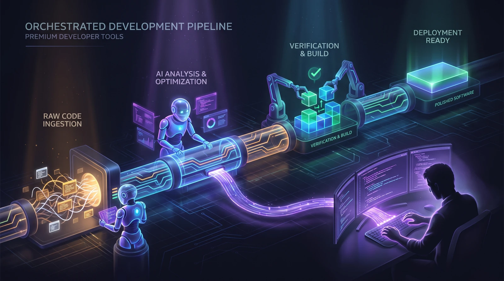

<sub><i>The whole workbench in one frame: a raw prompt goes in, verified software comes out, and every stage is gated.</i></sub>

<br/><br/>


<br/>

**[Why](#-why-agentic-mercy) · [Never-miss routing](#-never-miss-routing) · [218 skills](#-eight-superpowers-218-skills) · [The /invoke corps](#-one-command-a-whole-team) · [Codebase intelligence](#-self-healing-codebase-intelligence) · [Model autopilot](#-model-cost-autopilot) · [Install](#-install)**

</div>

> Migrating from v1? See the [release notes](https://github.com/AjayIrkal23/agentic-mercy-10x/releases) for the full story.

---

## 🩸 Why Agentic Mercy

AI coding agents are brilliant and **undisciplined**. Turned loose on a real codebase, the same failures repeat on every task. Agentic Mercy closes each one — permanently, and by default:

<div align="center">

| 😖 A stock agent | ⚡ agentic-mercy-10x |
|---|---|
| Forgets your standards halfway through a task | **Injects the right standard on every write** |
| Reads whole files, burns tokens, still misses the caller | **A symbol index + dependency graph answer in one call** |
| Codes first, understands never | **Gates the work: no code until there's a plan** |
| Says "Done!" — it never ran | **Runs the real flow and captures the real output** |
| Leaves dead code and rotted docs in its wake | **Sweeps orphans and syncs docs on every task** |
| Ships the SQL-injection you never saw | **Semgrep + OWASP gate the diff and say BLOCK** |
| Burns premium-model spend on a one-line fix | **Routes each task to the cheapest capable model** |

</div>

The system stands on six promises. Each one is enforced by code, not vibes:

- **🎯 Never-miss routing.** One smart router reads your intent once and hands the work the exact skills and specialists it needs — backed by **1,973 protected triggers**, a deduped session manifest, and a priority budget so nothing routable is ever silently dropped.
- **🧰 218 curated skills.** Standards, testing, security, forensics, and design craft — with **128 upstream packs provenance-locked and hash-verified** at install, so vendored skills update cleanly and never drift.
- **🎼 A ten-act specialist corps.** Auditor, architect, planner, engineer, debugger, designer, cleaner, doc-writer, verifier, and security sentinel — composed on demand through **one parametric `/invoke` command**.
- **🧠 Self-healing codebase intelligence.** The workspace auto-indexes the repo you're in — symbols, dependencies, docs — with **zero background daemons**. The agent never works blind.
- **💸 Model cost autopilot.** The right model per task: **Sonnet by default, Opus only where it earns its keep.** One policy file decides.
- **🛡️ Safety-railed end to end.** Atomic hooks that fail open, session telemetry, one-command rollback, and a manifested archive of everything the workspace keeps.

> [!WARNING]
> **This is opinionated on purpose.** The hooks enforce *real* gates — TDD advisories, a per-directory documentation tree, dead-code sweeps, security scans, skill-routing, and model-routing. They nudge (and sometimes block) you toward one disciplined way of working. That is the entire point. Skim [What the hooks enforce](#-what-the-hooks-enforce) so nothing surprises you.

---

## 🎯 Never-miss routing

The right skill or specialist shows up at the right moment without you asking. A **single router** sits between your prompt and the work. It classifies your intent **once** into a task profile, ranks skills by the files you're touching, packs the highest-signal set into a **priority budget**, and dedups anything the session already acknowledged.

<div align="center">
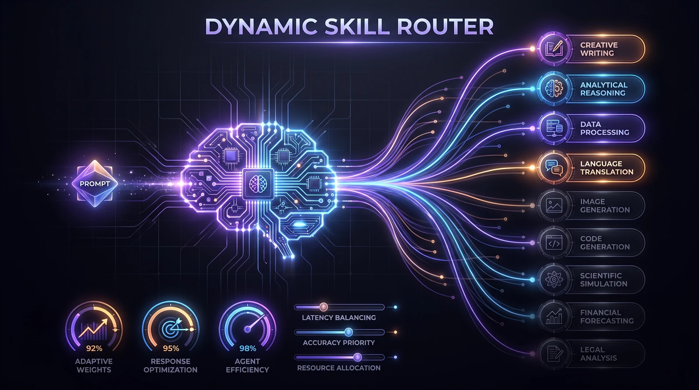
</div>

<sub align="center"><i>One classify-once router selects only the skills your prompt actually needs. Its trigger surface is a checksum-guarded floor of 1,973 verbatim rules — nothing routable ever slips through.</i></sub>

<br/>

| Piece | What it does |
|---|---|
| **Classify-once task profile** | Your intent and the paths you touch are read a single time; every downstream decision reuses that read |
| **Ranked selection into a priority budget** | Only the highest-signal skills load, priority-ordered and deduped against the session manifest |
| **Trigger floor** (`hooks/trigger-floor.json`) | **1,973 verbatim entries**, checksum-guarded, with a *never-remove* doctrine enforced in CI — the guarantee that nothing routable is missed |
| **Self-tuning weights** | A weight-updater learns which skills actually helped and re-ranks future routing; floor rules stay weight-independent |
| **One source of truth** | Every route and command composition lives in `hooks/autonomous-skill-router.config.json` |

And you often don't type a command at all: a plain-English prompt like *"fix this bug and clean up after"* is auto-classified, and the matching specialist chain fires on its own.

---

## 🦸 Eight superpowers, 218 skills

Every skill in the workspace exists to give a developer one of eight superpowers. This is the full roster — **the actual inventory, not a teaser** — of what 10x's your day.

<div align="center">
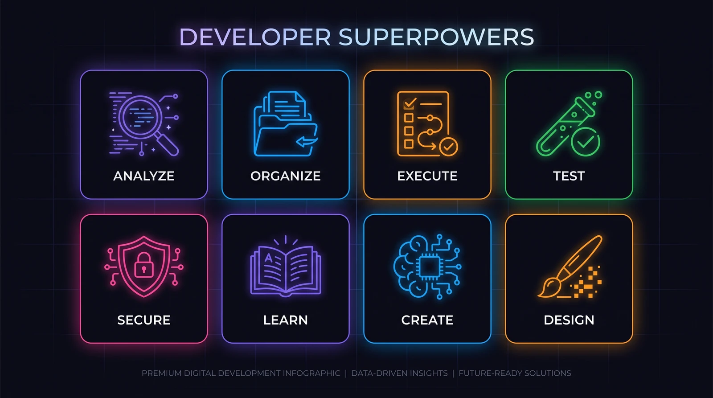
</div>

<sub align="center"><i>Eight capability lanes drawn from 218 skills. 128 of them are upstream-locked and hash-verified byte-for-byte at install, so vendored packs update cleanly.</i></sub>

<br/>

### 🔬 ① ANALYZE — see the whole codebase in one call

> *The agent queries a pre-built index instead of reading files blindly. This is where the token savings come from.*

| Skill / tool | What it 10x's |
|---|---|
| `codebase-intel-first` | Doctrine: build a structural model of the code, then read only what matters |
| `jcodemunch-token-saver` | Symbol index — find a function, its callers, and its blast radius in **one call**, not twenty file reads |
| `graphify` | Dependency graph — "who depends on X?" and "how do A and B connect?" answered instantly |
| `project-structure-map` · `project-reference-linkage` | Layer boundaries plus the cross-module wiring an unfamiliar repo hides |
| `lean-ctx` | Compressed I/O · 10 read modes · re-reads a file in **~13 tokens** |
| `caveman` | Output compression — **~75% fewer tokens**, full technical accuracy |

### 🗂️ ② ORGANIZE — a codebase that stays clean

| Skill | What it 10x's |
|---|---|
| `frontend-structure-standards` · `backend-standards-always-follow` · `service-layer-standards` | Domain-first frontend folders and clean route/controller/service/schema backend boundaries |
| `scaffold-standards` · `domain-scaffold-patterns` | New domain? Get the exact file tree emitted first, then write the logic |
| `api-contract-standards` · `api-and-interface-design` | Stable envelopes and typed contracts across the frontend/backend seam |
| `dead-code-and-change-audit` | Continuous hygiene — no orphaned imports, stale refs, or half-refactors survive |

### 🗺️ ③ EXECUTE — never vibe-code again

| Skill | What it 10x's |
|---|---|
| `plan-mode-gate` · `workflow-orchestrator` | Hard pre-flight: no code until there's a checked plan |
| `source-driven-development` | Every decision grounded in official docs, not stale memory |
| `sequential-thinking` (doctrine) | Externalize **all** reasoning — plan, audit, debug, decide |
| `ponytail` · `doubt-driven-development` | The simplest solution that works, then an adversarial self-review |
| `incremental-implementation` · `subagent-driven-development` | Ship in safe slices and fan out independent work |

### 🧪 ④ TEST — prove it works, don't claim it

| Skill | What it 10x's |
|---|---|
| `test-driven-development` · `golang-testing` | Red, green, refactor; table-driven Go tests |
| `webapp-testing` · `browser-testing-with-devtools` | Real-browser DOM, console, network, and visual checks |
| `verification-loop` · `eval-harness` | A finish line the agent has to actually cross |
| `systematic-debugging` · `debug-investigation` | Reproduce, find root cause, minimal fix — no fix without a cause |

### 🛡️ ⑤ SECURE — ship without holes

| Skill / agent | What it 10x's |
|---|---|
| `owasp-security` · `security-and-hardening` | OWASP Top 10 (2025), ASVS, and LLM/agentic threats baked into every review |
| `security-sentinel` (agent) | A Semgrep + OWASP pass on the diff, returning a **BLOCK / PASS** verdict |
| `backend-error-handling` | Safe logging, secret redaction, client-safe error mapping |

### 📖 ⑥ LEARN — never forget, never re-derive

| Skill / system | What it 10x's |
|---|---|
| `memory` (MCP) + memory protocol | Patterns, decisions, and fragile-area gotchas persist across sessions |
| `dox-doc-tree` | A `CLAUDE.md` + `AGENTS.md` in **every** directory — read root to target, then edit |
| `update-docs` · `CODEX.md` | Docs and ADRs stay synced to the change, gate-enforced, in a living decision log |

### 🎼 ⑦ CREATE — a whole team of specialists in a box

| Skill / agent | What it 10x's |
|---|---|
| Ten-act specialist corps + parametric `/invoke` | Audit · spec · plan · implement · debug · design · clean · docs · verify · security — composed on demand |
| `forensic-hotspot-finder` · `forensic-change-coupling` | Which files cause the most bugs; what quietly changes together |
| `forensic-complexity-trends` · `forensic-debt-quantification` | Is quality trending up? What does the debt cost in **dollars**? |

### 🎨 ⑧ DESIGN — UI that doesn't look AI-generated

| Skill / engine | What it 10x's |
|---|---|
| `impeccable` · `taste-skill` · `ui-ux-pro-max` · `huashu-design` | Anti-slop craft: tokens, typography, hierarchy, motion |
| `frontend-ui-engineering` · `design-extract` | Production UIs; extract a design system from any live URL |
| **Higgsfield** asset engine | Bespoke image / video / 3D / audio — real assets, never placeholders |

---

## 🎼 One command, a whole team

Type `/invoke audit spec plan impl design` and a **whole cross-functional team wakes up in order** — an auditor, an architect, a planner, an engineer, a designer — each a clean-context specialist that hands its artifact to the next.

<div align="center">
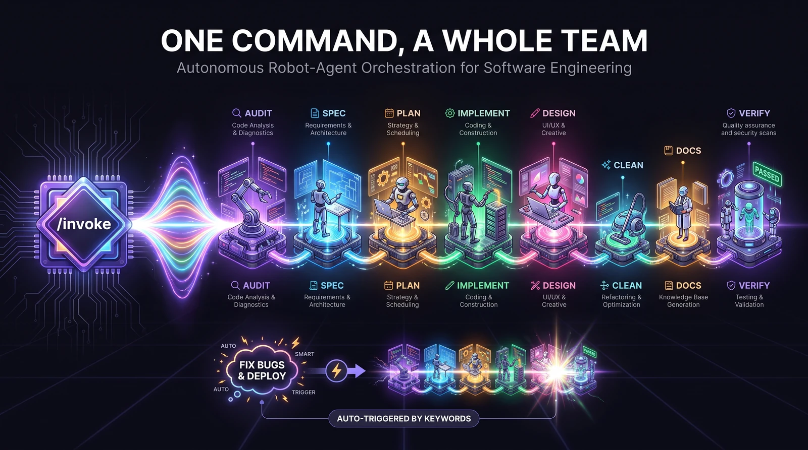
</div>

<sub align="center"><i>One parametric /invoke composes the ten-act specialist corps. Twenty command files back it; a plain-English prompt triggers the matching chain automatically.</i></sub>

<br/>

Every invocation runs the same **three acts** — which is why they compose so cleanly:

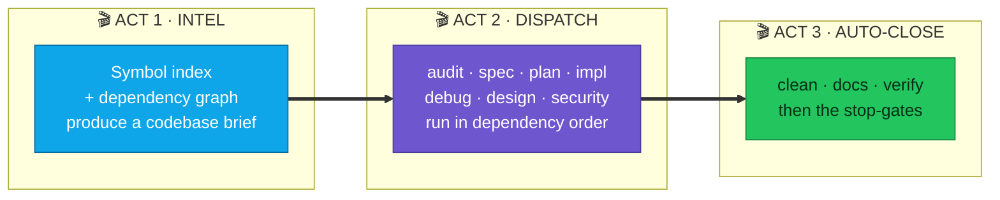
```mermaid
flowchart LR
    subgraph ACT1["🎬 ACT 1 · INTEL"]
      direction TB
      I["Symbol index<br/>+ dependency graph<br/>produce a codebase brief"]:::a1
    end
    subgraph ACT2["🎬 ACT 2 · DISPATCH"]
      direction TB
      D["audit · spec · plan · impl<br/>debug · design · security<br/>run in dependency order"]:::a2
    end
    subgraph ACT3["🎬 ACT 3 · AUTO-CLOSE"]
      direction TB
      C["clean · docs · verify<br/>then the stop-gates"]:::a3
    end
    I ==> D ==> C

    classDef a1 fill:#0EA5E9,stroke:#0369A1,color:#fff
    classDef a2 fill:#6E56CF,stroke:#4B3B9C,color:#fff
    classDef a3 fill:#22C55E,stroke:#15803D,color:#052e16
```

Compose the acts freely: `/invoke audit spec plan impl clean` runs the whole spine; `/invoke debug` runs one act. Twenty command files back the surface, and any command name resolves through the invoke translator.

#### The specialist corps

<div align="center">

| Agent | Act | Owns |
|-------|----------|------|
| 🔬 `audit-specialist` | **AUDIT** | Forensic hotspots, coupling and churn, dead code, repo-health — cited findings. |
| 📐 `spec-architect` | **SPEC** | Requirements into typed contracts, acceptance criteria, an explicit Not-Doing list. |
| 🗺️ `planning-director` | **PLAN** | A spec into a dependency-ordered, file-pathed, per-task-TDD plan. |
| ⚙️ `implementation-engineer` | **IMPLEMENT** | Executes the plan task-by-task with TDD *(runs on Opus by directive)*. |
| 🐞 `debug-detective` | **DEBUG** | Reproduce, demonstrate root cause, minimal fix. *No fix without a cause.* |
| 🎨 `frontend-uiux-designer` | **DESIGN** | Anti-slop UI via a six-skill design stack *(runs on Opus)*. |
| 🧹 `deadcode-reaper` | **CLEAN** | Removes only what *this* session's diff orphaned; delete-safe. |
| 📖 `docs-sync-agent` | **DOCS** | Syncs docs and the per-directory `CLAUDE.md` tree to the change. |
| ✅ `qa-verifier` | **VERIFY** | Runs the real flow and captures real output — evidence, not assertions. |
| 🕵️ `security-sentinel` | **SECURITY** | A Semgrep + OWASP pass on the diff, returning a BLOCK/PASS verdict. |

</div>

GSD, Figma, and Vercel helper agents round out the roster.

---

## 🎬 What happens when you hit Enter

Every task runs the same disciplined spine — **understand · build · auto-close · prove** — with gates that don't let sloppiness through. This is the full lifecycle, from the moment you open a project to the moment the agent is *allowed* to say "done":

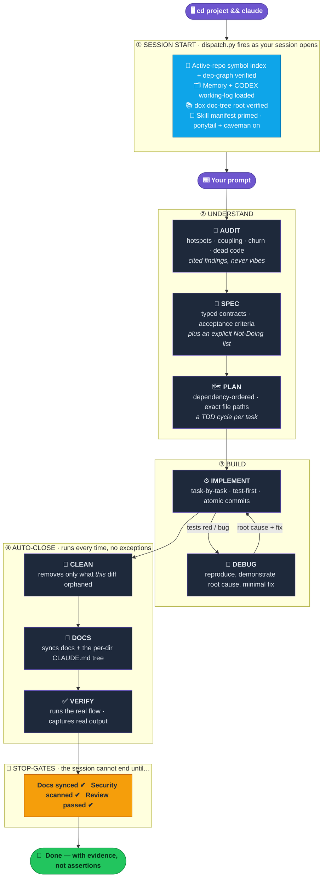
```mermaid
flowchart TD
    A(["🖥️  cd project && claude"]):::start --> S0

    subgraph S0["①  SESSION START · dispatch.py fires as your session opens"]
      B["🧠 Active-repo symbol index + dep-graph verified<br/>🗂️ Memory + CODEX working-log loaded<br/>📚 dox doc-tree root verified<br/>🧾 Skill manifest primed · ponytail + caveman on"]:::hook
    end

    S0 --> P(["⌨️  Your prompt"]):::start

    subgraph S1["②  UNDERSTAND"]
      AU["🔬 <b>AUDIT</b><br/>hotspots · coupling · churn · dead code<br/><i>cited findings, never vibes</i>"]:::agent
      SP["📐 <b>SPEC</b><br/>typed contracts · acceptance criteria<br/><i>plus an explicit Not-Doing list</i>"]:::agent
      PL["🗺️ <b>PLAN</b><br/>dependency-ordered · exact file paths<br/><i>a TDD cycle per task</i>"]:::agent
    end

    P --> AU --> SP --> PL

    subgraph S2["③  BUILD"]
      IM["⚙️ <b>IMPLEMENT</b><br/>task-by-task · test-first · atomic commits"]:::agent
      DB["🐞 <b>DEBUG</b><br/>reproduce, demonstrate root cause, minimal fix"]:::agent
    end

    PL --> IM
    IM -->|"tests red / bug"| DB
    DB -->|"root cause + fix"| IM

    subgraph S3["④  AUTO-CLOSE · runs every time, no exceptions"]
      CL["🧹 <b>CLEAN</b><br/>removes only what <i>this</i> diff orphaned"]:::agent
      DX["📖 <b>DOCS</b><br/>syncs docs + the per-dir CLAUDE.md tree"]:::agent
      VF["✅ <b>VERIFY</b><br/>runs the real flow · captures real output"]:::agent
    end

    IM --> CL --> DX --> VF

    subgraph GATES["🚧  STOP-GATES · the session cannot end until…"]
      G["Docs synced ✔   Security scanned ✔   Review passed ✔"]:::gate
    end

    VF --> G --> DONE(["🎉  Done — with evidence, not assertions"]):::done

    classDef start fill:#6E56CF,stroke:#4B3B9C,color:#fff,font-weight:bold
    classDef hook fill:#0EA5E9,stroke:#0369A1,color:#fff
    classDef agent fill:#1E293B,stroke:#6E56CF,color:#E2E8F0
    classDef gate fill:#F59E0B,stroke:#B45309,color:#1E293B,font-weight:bold
    classDef done fill:#22C55E,stroke:#15803D,color:#052e16,font-weight:bold
```

You don't run those stages by hand. One **parametric `/invoke <acts…>`** command composes them, and a plain-English prompt triggers the matching chain automatically.

---

## 🧠 Self-healing codebase intelligence

Every superpower rests on the agent **never working blind** — and that costs you nothing. An event-driven state machine keeps four surfaces fresh (jcodemunch symbols, jdocmunch docs, graphify dependencies, and the dox tree) **for the active repo only**, using **detached single-shot builders** with a debounced reindex. There are **zero daemons**, and by construction it *cannot* touch any other repo.

<div align="center">
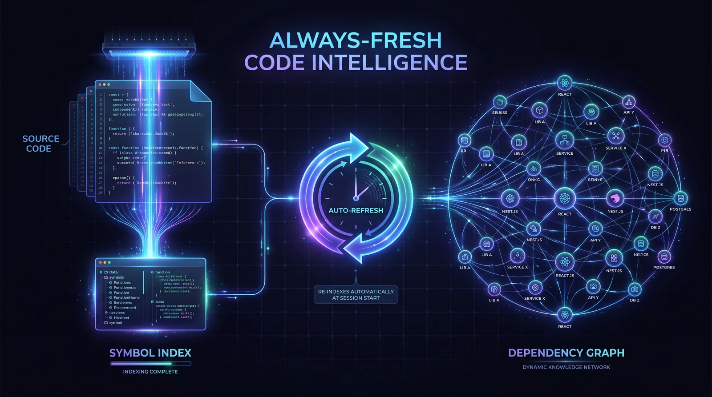
</div>

<sub align="center"><i>Symbol index plus dependency graph, refreshed on session and write events — active repo only, single-shot builders, no always-on watchers.</i></sub>

<br/>

**Why it matters:** a stock agent re-derives structure with grep on *every* task and still misses cross-module edges. Here it's a one-call lookup against an always-current map — which is exactly where the [token savings](#-the-token-economy) come from.

---

## 🛡️ Hooks — where the enforcement lives

Skills are *advice.* **Hooks are the enforcement.** Eight per-event `dispatch.py` orchestrators drive the lifecycle, and every hook stays its own isolated module with a `type`, an `enabled` flag, a priority, and a token budget. One link crashing can't take down its event.

<div align="center">
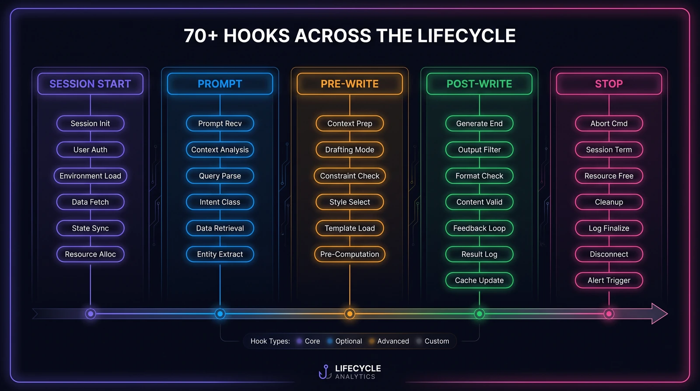
</div>

<sub align="center"><i>Five lifecycle phases, each driven by one of eight event dispatchers; every hook stays an isolated file, and a link-doctor synthetically fires every one.</i></sub>

<br/>

Some links don't just advise — they **gate.** A risky change runs a gauntlet, and a session can't even *end* until the closing gates pass:

<div align="center">
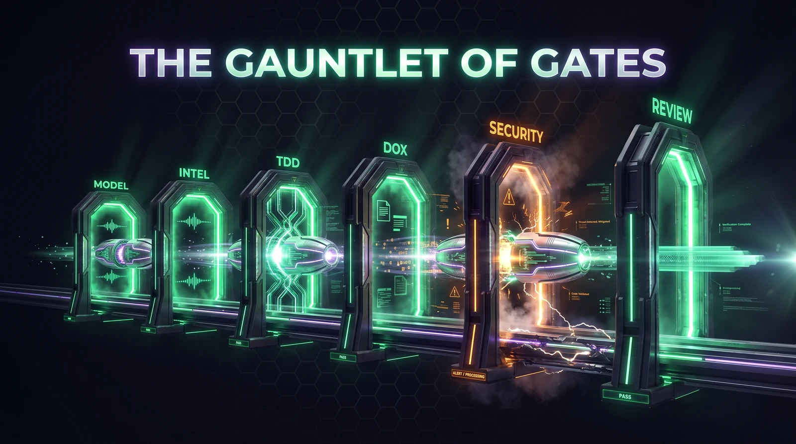
</div>

<sub align="center"><i>The gate chain — model routing, intel-first, TDD guard, dox tree, security scan, review — enforced by isolated links inside the pre-write and Stop dispatchers.</i></sub>

<br/>

| Phase | What the dispatcher does | Isolated links (a few) |
|---|---|---|
| **① SessionStart** | Boot knowing the codebase | `jcodemunch-index-guard` · `memory-load-on-start` · `dox-tree-guard` · `tdd-guard-init-guard` |
| **② UserPromptSubmit** | Shape the request | the unified prompt router · `sequential-thinking-mandate` |
| **③ PreToolUse** | Gate and route every action | `opus-guard` · `jcodemunch-enforce` · `dox-write-gate` · `tdd-guard-gate` · `security-scan-gate` |
| **④ PostToolUse** | Clean up after every write | `desloppify-cleanup` · `doc-update-enforcer` · `dox-child-scaffold` |
| **⑤ Stop** | Prove it's done, then learn | `hard-completion-gate` · `santa-method-writer` · `session-memory-writer` |

---

## 💸 Model cost autopilot

The right model runs each task, and one file decides. Sonnet handles everything by default; Opus is reserved for the work that earns it.

<div align="center">

| Tier | When | Source of truth |
|---|---|---|
| **Sonnet** | The default for everything | `hooks/model-policy.json` |
| **Opus** | UI/UX work · genuinely heavy builds · the **IMPLEMENT** carve-out | `invoke_categories.IMPLEMENT: "opus"` |
| **Fable** | Explicit user request only — never automatic | user-driven flag |

</div>

`model-policy.json` is the **single** place model choice lives. `opus-guard.py` pins each subagent's model from its `[sonnet]`/`[opus]`/`[fable]` prefix, and `workflow-model-guard.py` keeps workflow subagents from inheriting an Opus parent — the silent token burn a stock setup never notices.

---

## 💰 The token economy

Here is the part that pays for itself. A stock agent answers a question by **reading files** — it grep-scans, opens a dozen, and drowns its own context. This workspace answers by **querying a pre-built symbol index and dependency graph**, then compresses everything that flows through. At the prompt layer, one classify-once router packs the highest-signal skills into a priority budget instead of spawning a fleet of injectors.

<div align="center">
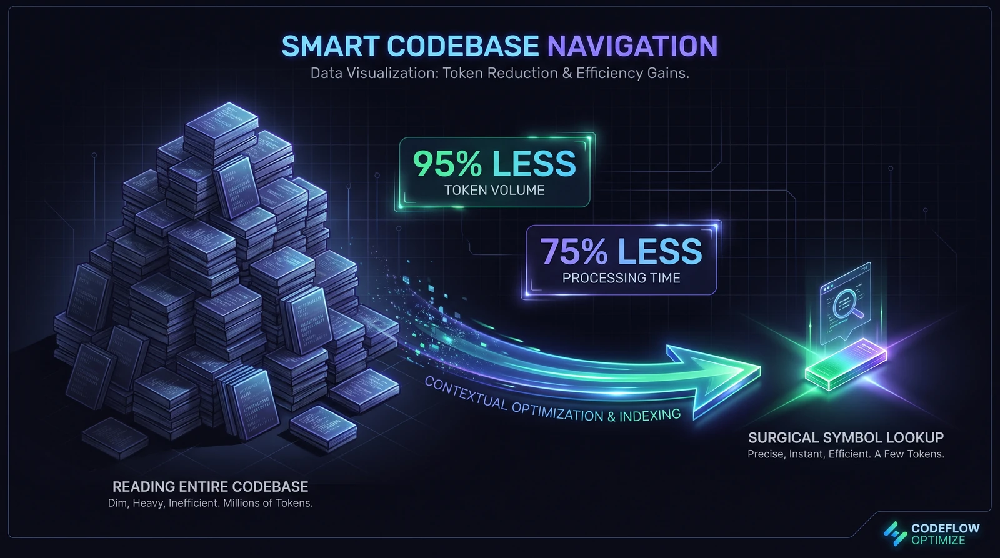
</div>

<sub align="center"><i>Two compounding wins: surgical index lookups instead of blind file dumps, and one classify-once router packed into a priority budget instead of many prompt-time injector spawns.</i></sub>


```mermaid
xychart-beta
    title "Tokens spent per task — stock agent vs agentic-mercy-10x (illustrative)"
    x-axis ["Find callers", "Grok a module", "Re-read a file", "Explain change"]
    y-axis "Tokens" 0 --> 80000
    bar [45000, 80000, 3000, 1200]
    bar [1500, 6000, 13, 300]
```

<div align="center"><i>Taller bar = stock agent · shorter bar = this workspace. Illustrative estimates drawn from each skill's stated savings.</i></div>

<br/>

| Everyday task | 🐌 Stock agent | ⚡ agentic-mercy-10x | Saved |
|---|---:|---:|---:|
| "Who calls `processPayment`?" | grep + read ~15 files ≈ **45k tok** | `find_references` ≈ **1.5k tok** | **~97%** |
| "Understand this module ahead of an edit" | read the whole dir ≈ **80k tok** | `assemble_task_context` ≈ **6k tok** | **~92%** |
| "Re-read a file after an edit" | full re-read ≈ **3k tok** | `lean-ctx` diff ≈ **13 tok** | **~99%** |
| "Explain the change you made" *(output)* | verbose prose ≈ **1.2k tok** | `caveman` ≈ **300 tok** | **~75%** |

> Numbers are illustrative estimates drawn from each skill's own stated savings (`jcodemunch-token-saver` ≈ 95% on retrieval, `caveman` ≈ 75% on output, `lean-ctx` ≈ 13-token re-reads). Your mileage varies with repo size — the *shape* of the win does not.

---

## 🧭 The agent always knows where to look

Point a stock agent at an unfamiliar repo and it wanders — opening files, guessing, backtracking. This workspace gives it a **GPS**: `codebase-start-point-guide` sets the entry point, and `project-reference-linkage` + `project-structure-map` trace the exact vertical slice a change touches, so it walks straight to the right files and skips the rest.

<div align="center">
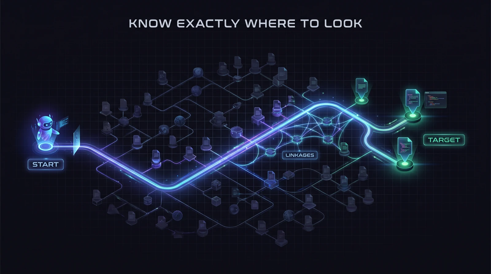
</div>

<sub align="center"><i>Start point, then the exact vertical slice, then done. The linkage map keeps every node in the chain traceable so nothing downstream is missed.</i></sub>

<br/>

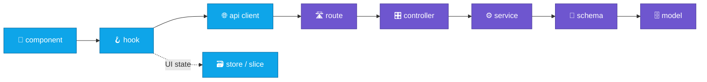
```mermaid
flowchart LR
    C["🧩 component"]:::fe --> H["🪝 hook"]:::fe --> A["🌐 api client"]:::fe
    A --> RT["🛣️ route"]:::be --> CT["🎛️ controller"]:::be --> SV["⚙️ service"]:::be
    SV --> SC["📐 schema"]:::be --> MD["🗄️ model"]:::be
    H -.->|"UI state"| ST["🗃️ store / slice"]:::fe

    classDef fe fill:#0EA5E9,stroke:#0369A1,color:#fff
    classDef be fill:#6E56CF,stroke:#4B3B9C,color:#fff
```

---

## 🗂️ Your codebase stays structured

Left unattended, an AI agent turns any codebase into spaghetti — files wherever, types inline, dead code everywhere. This workspace makes structure **non-optional**: every new domain lands in a known shape, every layer boundary holds, and the cross-module wiring is mapped up front.

<div align="center">
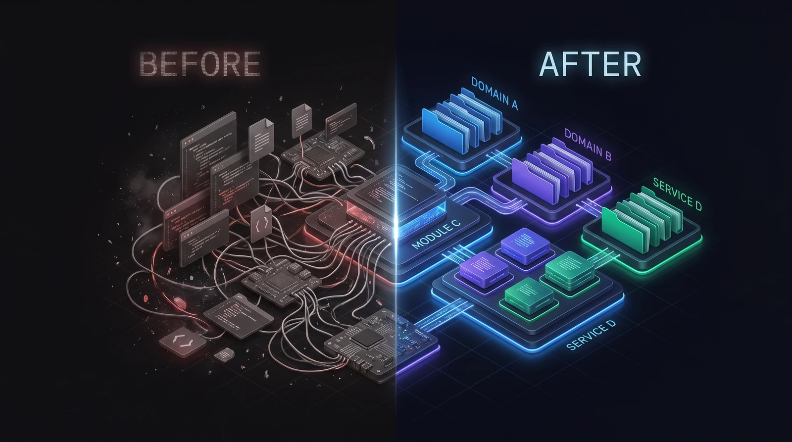
</div>

<sub align="center"><i>The default outcome, not the hoped-for one: domain-organized structure enforced at scaffold time, write time, and close time.</i></sub>

<br/>

### The standards, made visual

Four always-on skill sets decide *where every file goes and what shape it takes* — so the clean structure above is what you get by default:

<table>
<tr>
<td width="50%">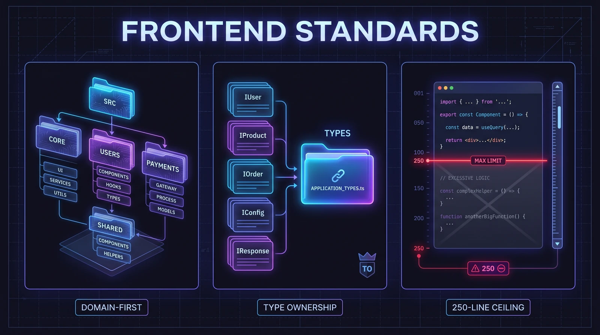<br/><b>Frontend</b> — <code>frontend-structure-standards</code> · <code>frontend-standards-always-follow</code>: domain-first folders, central type ownership, a hard 250-line file ceiling.</td>
<td width="50%">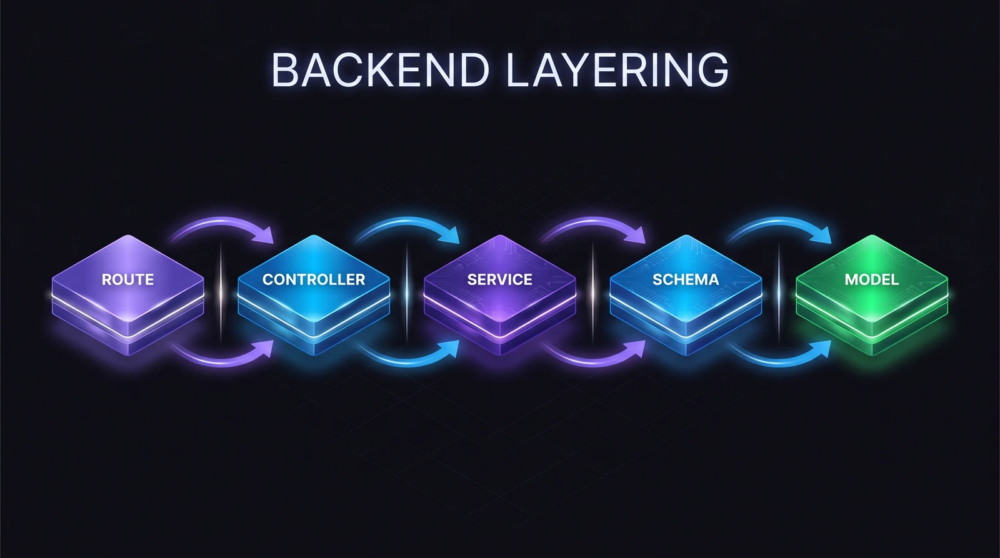<br/><b>Backend</b> — <code>backend-standards-always-follow</code> · <code>service-layer-standards</code> · <code>backend-api-standards</code>: route, controller, service, schema, model — boundaries that never blur.</td>
</tr>
<tr>
<td width="50%">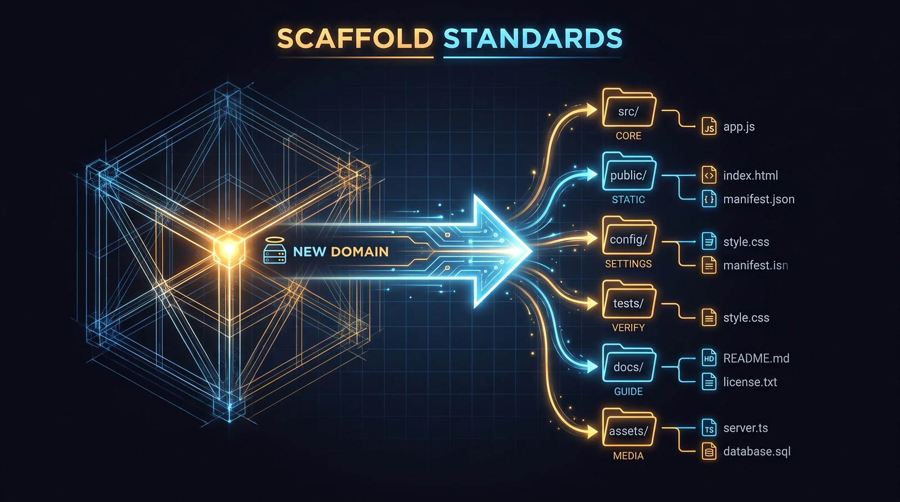<br/><b>Scaffold</b> — <code>scaffold-standards</code> · <code>domain-scaffold-patterns</code>: a new domain emits its exact file tree, validated against real Fastify/TS, FastAPI/Python, and Go/chi codebases.</td>
<td width="50%">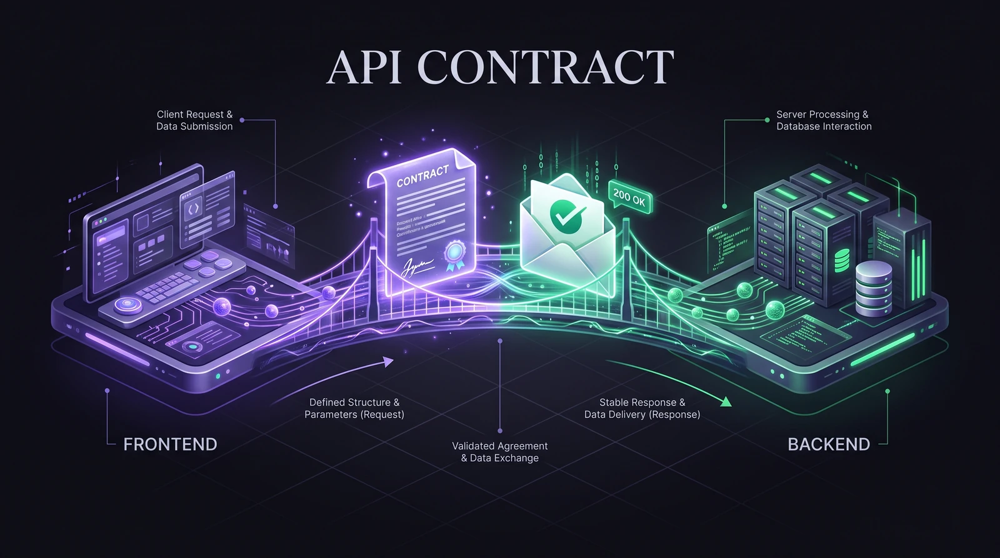<br/><b>Contract</b> — <code>api-contract-standards</code> · <code>api-and-interface-design</code>: one typed, stable envelope across the frontend/backend seam — no parallel shapes.</td>
</tr>
</table>

Three enforcement layers keep it that way:

- **At scaffold time** — `scaffold-standards` + `domain-scaffold-patterns` emit the exact file tree.
- **At write time** — structure skills inject on every edit; the 250-line ceiling and layer boundaries are checked.
- **At close time** — `dead-code-and-change-audit` sweeps orphans and the `dox` tree drops a `CLAUDE.md` into any directory you touched.

---

## 📖 A self-documenting codebase

The **dox tree** guarantees every directory in every repo carries a `CLAUDE.md` (plus an `AGENTS.md` pointer) — and the moment you create a new folder, a link inside the PostToolUse dispatcher **auto-scaffolds** its doc. The agent reads root to target ahead of every edit, so it always inherits the local rules of the exact place it's working.

<div align="center">
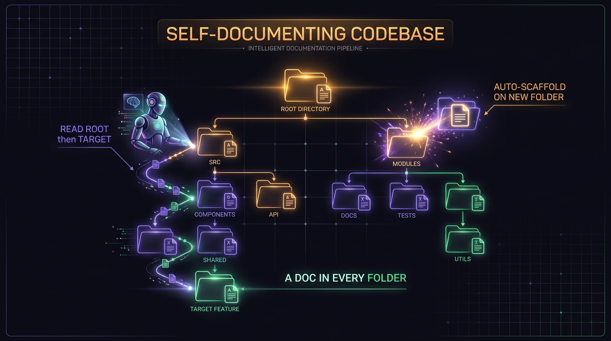
</div>

<sub align="center"><i>A doc in every folder, auto-scaffolded into new ones, read root to target ahead of any edit — so the agent never violates a local rule it didn't know existed.</i></sub>

---

## 🎨 UI that never looks AI-generated

Most AI writes **slop UI** — templated cards, the same purple gradient, zero intention. This workspace refuses. A six-skill anti-slop design stack — on top of the **Higgsfield** asset engine — turns a brief into interfaces that look deliberately crafted.

<div align="center">
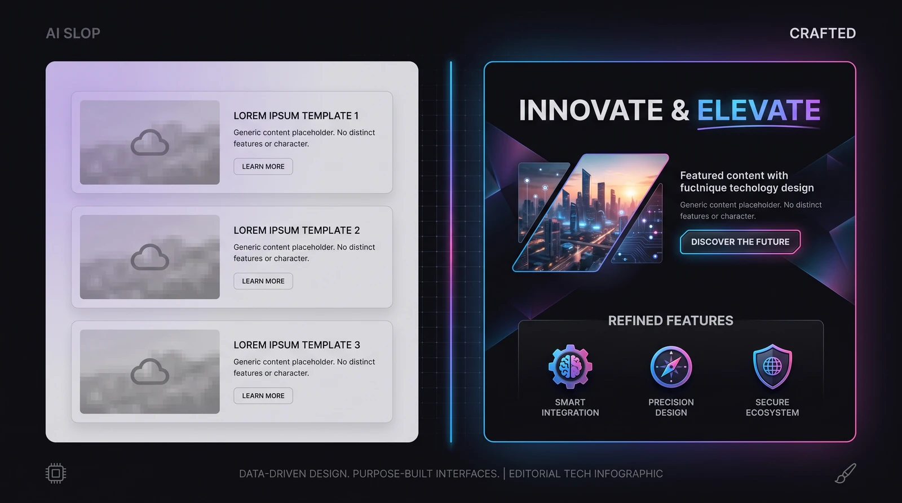
</div>

<sub align="center"><i>Slop in, craft out: the six-skill stack replaces templated defaults with intentional tokens, type, and hierarchy.</i></sub>

<br/>

<table>
<tr>
<td width="50%">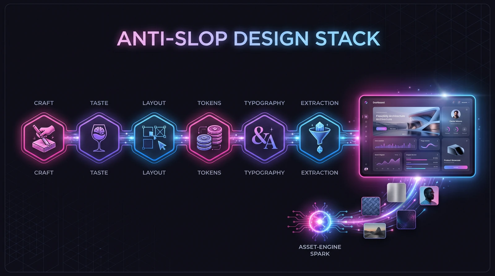<br/><b>The stack</b> — <code>impeccable</code> · <code>taste-skill</code> · <code>ui-ux-pro-max</code> · <code>huashu-design</code> · <code>frontend-ui-engineering</code> · <code>design-extract</code>, fed by Higgsfield-generated assets.</td>
<td width="50%">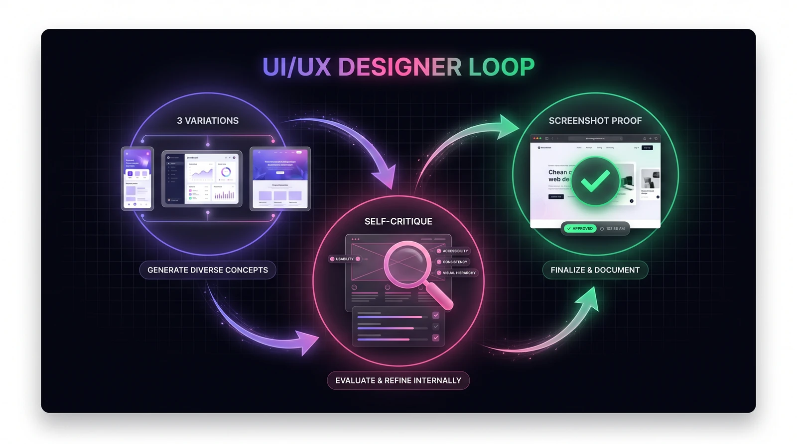<br/><b>The loop</b> — the <code>frontend-uiux-designer</code> agent explores <b>3 variations</b>, runs a <b>self-critique</b> pass, then captures <b>screenshot proof</b> at real breakpoints ahead of presenting.</td>
</tr>
</table>

---

## 🏛️ Five layers, one discipline

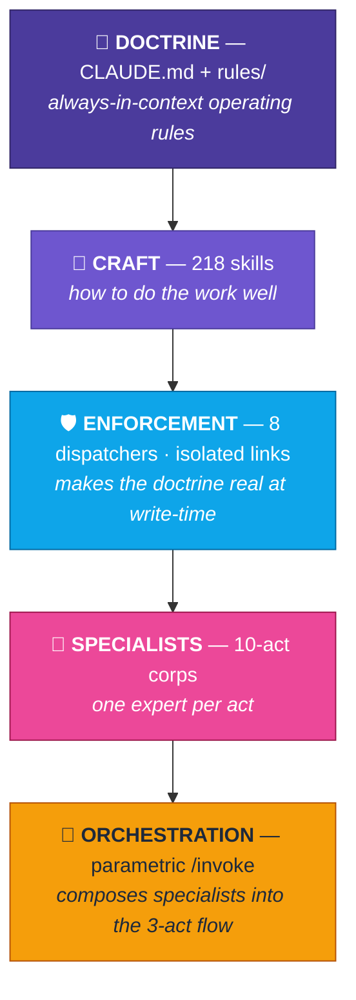
```mermaid
flowchart TD
    L1["🧭 <b>DOCTRINE</b> — CLAUDE.md + rules/<br/><i>always-in-context operating rules</i>"]:::l1
    L2["🎨 <b>CRAFT</b> — 218 skills<br/><i>how to do the work well</i>"]:::l2
    L3["🛡️ <b>ENFORCEMENT</b> — 8 dispatchers · isolated links<br/><i>makes the doctrine real at write-time</i>"]:::l3
    L4["🤖 <b>SPECIALISTS</b> — 10-act corps<br/><i>one expert per act</i>"]:::l4
    L5["🎼 <b>ORCHESTRATION</b> — parametric /invoke<br/><i>composes specialists into the 3-act flow</i>"]:::l5
    L1 --> L2 --> L3 --> L4 --> L5

    classDef l1 fill:#4B3B9C,stroke:#312566,color:#fff
    classDef l2 fill:#6E56CF,stroke:#4B3B9C,color:#fff
    classDef l3 fill:#0EA5E9,stroke:#0369A1,color:#fff
    classDef l4 fill:#EC4899,stroke:#9D174D,color:#fff
    classDef l5 fill:#F59E0B,stroke:#B45309,color:#1E293B
```

| Layer | Path | Role |
|-------|------|------|
| **1 · Doctrine** | `CLAUDE.md`, `rules/` | Always-in-context operating rules — model routing, skill protocol, TDD/dox/codebase-intel doctrine. |
| **2 · Craft** | `skills/` | 218 skills the agent invokes to *do the work well* (standards, testing, security, design, forensics). |
| **3 · Enforcement** | `hooks/` | 8 event dispatchers wiring isolated links — skill injection, index guards, write gates, model guards, stop-gates. |
| **4 · Specialists** | `agents/` | A ten-act specialist corps plus a UI/UX designer and GSD/Figma/Vercel helpers. |
| **5 · Orchestration** | `commands/` | 20 `/invoke` files composing the specialists into the 3-act flow. |

---

## 🚀 Install

**One command**, on Ubuntu/macOS **or** Windows. `install.py` is a stdlib-only bootstrap (Python ≥ 3.10), OS auto-detected through `hooks/lib/platform.py`, idempotent, and non-destructive.

**Ubuntu / macOS**

```bash
git clone https://github.com/AjayIrkal23/agentic-mercy-10x ~/.claude && python3 ~/.claude/install.py
```

**Windows (PowerShell)**

```powershell
git clone https://github.com/AjayIrkal23/agentic-mercy-10x $env:USERPROFILE\.claude ; py -3 $env:USERPROFILE\.claude\install.py
```

`install.py` runs, in order: **detect** OS/python/node/git · idempotent **deps** · register the **MCP servers** · **materialize** skills (copy or NTFS junction, never a symlink) · **render** `settings.json` from its tracked `settings.template.json` (plus optional `settings.user.json` overrides) · **build and validate** the skills catalog (trigger-floor guard + upstream-intactness) · run **doctor**.

```bash
python install.py doctor     # health + trigger-surface + model-routing verifier
python install.py update     # git pull --ff-only · deps · re-render · rebuild · doctor
```

Flags: `--dry-run` (print planned actions, mutate nothing) · `--ci` (skip networked steps). Every path resolves through `hooks/lib/platform.py` — **no hardcoded usernames or drive letters**, and there are **zero `.sh` hooks** — so it works for any user on either OS.

> [!TIP]
> Want a lighter footprint? Everything is à-la-carte. Prune `settings.json` and any dispatcher links you don't want — the system fails *open* where it matters, so removing a gate degrades gracefully instead of breaking.

---

## ✅ Quality, proven on every push

**Every push is verified on both `ubuntu-latest` and `windows-latest`.** These checks run in CI and at install time, so a regression is caught the moment it lands — not mid-session.

<div align="center">

| Check | Result |
|---|---|
| **CI matrix** | green on **Ubuntu + Windows**, every push |
| **Doctor** (`installer/doctor.py`) | **13 / 13** PASS, 0 WARN, 0 FAIL |
| **Test suite** (hook + router + installer) | **136 / 136** passed |
| **Skills validator** | **0 hard failures**; **128 upstream-locked skills hash-clean** |
| **Trigger floor** | **1,973** entries, checksum-matched |
| **Render equivalence** | `render(template)` == `settings.json`, byte-identical |
| **Symlinks** | **0** (Windows-safe) |
| **SessionStart wall** | **< 0.8s** |

</div>

---

## 🛡️ Safety & reversibility

Every layer is safe to touch, and nothing is lost:

- **Fail-open by design** — every hook degrades to a pass on a crash, never a wedged session.
- **One-command rollback** — a tagged git anchor restores the entire workspace in a single command.
- **Nothing is deleted** — no skill is ever removed; `attic/` holds a manifested archive so anything the active surface doesn't load is still on disk.
- **Regenerate on demand** — `gen-invoke-commands.py --emit-combos` expands every command name to its own file whenever you want it.

---

## 🧩 What's NOT included

By design, the repo excludes anything that is a secret, a session artifact, personal data, or re-installable from elsewhere:

- **Secrets** — `.credentials.json`, API keys, tokens, and `~/.claude.json` (your MCP config) are never committed. `settings.json` references env vars (e.g. `${GITHUB_TOKEN}`) instead.
- **Sessions & personal data** — `projects/`, `history.jsonl`, `sessions/`, `file-history/`, `todos/`, shell snapshots, and per-machine state.
- **Re-installable externals** — the plugin cache/marketplaces, `skills/gstack/`, `ast-grep-mcp/`, and the GSD (`get-shit-done/`) system. The installer and notes fetch these.

After install, finish the setup:

1. **Plugins** — add the marketplaces (`anthropics/claude-plugins-official`, `veelenga/claude-mermaid`, `obra/superpowers-marketplace`, `forrestchang/andrej-karpathy-skills`, `DietrichGebert/ponytail`) and `claude plugin install` the ones you want.
2. **MCP servers** — the hooks expect `jcodemunch`, `graphify`, `lean-ctx`, `memory`, `sequential-thinking`, and `context7` configured in your own `~/.claude.json`. Trim what you don't use.
3. **Code-intelligence engines (recommended)** — the symbol and docs indexes come from [jCodeMunch](https://j.gravelle.us/jCodeMunch/descriptions.php). Install via uv, then register:

   ```bash
   uv tool install jcodemunch-mcp && uv tool install jdocmunch-mcp   # Windows: pipx install <name>
   claude mcp add --scope user jcodemunch jcodemunch-mcp
   claude mcp add --scope user jdocmunch jdocmunch-mcp               # or run scripts/install-jdocmunch.sh
   ```

   The installer prints the same guidance if either engine is missing; everything else works without them.
4. **Secrets** — export your own tokens; nothing is shipped.

---

## 🛠️ Customization

This workspace is meant to be forked and tuned. Edit the **sources of truth**, not the generated artifacts:

- **`hooks/autonomous-skill-router.config.json`** — which skills each `/invoke` category loads and how the acts compose.
- **`hooks/model-policy.json`** — the single model truth (sonnet default · opus UI+heavy+IMPLEMENT · fable explicit-only).
- **`hooks/dispatch.config.json`** — the 8 dispatchers and their per-link enable flags, priorities, and budgets.
- **`hooks/trigger-floor.json`** — the never-miss routing surface; rebuilt by `hooks/build-trigger-floor.py`.
- **`hooks/gen-invoke-commands.py`** — regenerates the 20 `/invoke` command files deterministically.
- **`hooks/skills-provenance.json`** — every skill's upstream source and pinned version (authored-here vs. vendored).
- **`settings.template.json`** — rendered by `installer/render.py` into `settings.json`; holds hook wiring, MCP servers, and permissions.

---

## 🚧 What the hooks enforce

So there are no surprises — the workspace ships opinionated gates. The notable ones:

- **Skill routing** — path-ranked skills inject on writes; the session manifest batches what you haven't read.
- **Codebase-intel-first** — blind source reads are steered toward the `jcodemunch` symbol index and `graphify` dependency graph.
- **TDD guard** (warn mode) — flags implementation written without a failing test first. Advisory, treated as a directive.
- **dox documentation tree** — every git repo gets a `CLAUDE.md` + `AGENTS.md` in every directory; code writes are gated until a root `CLAUDE.md` exists.
- **Model routing** — subagents default to Sonnet unless explicitly escalated (`model-policy.json`).
- **Stop-gates** — docs sync, security scan (when auth files change), and a review pass — all gating the end of a session.

All hooks fail *open* where it matters, but they change how the agent behaves. For a lighter setup, prune `settings.json` and the dispatcher links you don't want.

---

## 🙏 Credits

This workspace stands on excellent third-party skills. **Each keeps its own upstream license** — see each project for terms. The 128 upstream-locked skills are hash-verified byte-intact at install, and `hooks/skills-provenance.json` records the exact source and pinned version of every vendored skill. Huge thanks to their authors:

| Skill / suite | Upstream |
|---------------|----------|
| Impeccable (UI/UX craft) | [pbakaus/impeccable](https://github.com/pbakaus/impeccable) |
| Huashu Design (花叔) | [alchaincyf/huashu-design](https://github.com/alchaincyf/huashu-design) |
| UI/UX Pro Max | [nextlevelbuilder/ui-ux-pro-max-skill](https://github.com/nextlevelbuilder/ui-ux-pro-max-skill) |
| Taste-Skill (anti-slop frontend) | [Leonxlnx/taste-skill](https://github.com/Leonxlnx/taste-skill) |
| gstack (ship/QA/browse/design suite) | [garrytan/gstack](https://github.com/garrytan/gstack) |
| Superpowers | [obra/superpowers-marketplace](https://github.com/obra/superpowers-marketplace) |
| Ponytail (anti-over-engineering) | [DietrichGebert/ponytail](https://github.com/DietrichGebert/ponytail) |
| Karpathy Guidelines | [forrestchang/andrej-karpathy-skills](https://github.com/forrestchang/andrej-karpathy-skills) |
| ast-grep MCP | [ast-grep/ast-grep-mcp](https://github.com/ast-grep/ast-grep-mcp) |

Frontend design assets are generated with Higgsfield; GSD (`get-shit-done`) supplies the `gsd-*` command system.

---

## 📄 License

The workspace's own authored content (hooks, agents, commands, rules, self-authored skills, and this documentation) is **MIT-licensed** — see [LICENSE](LICENSE). © 2026 Ajay Irkal.

**Third-party skills under `skills/` retain their own upstream licenses** (see the Credits table). MIT applies to the original work in this repository, not to vendored code.

<div align="center">
<br/>

**If your agent has ever vibe-coded you into a corner — this is the way out.**

⭐ *Star it, fork it, bend it to your taste.*

</div>
