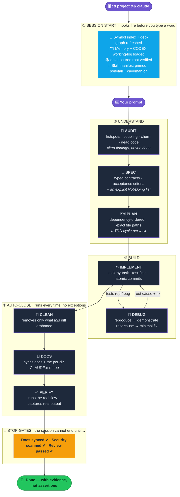
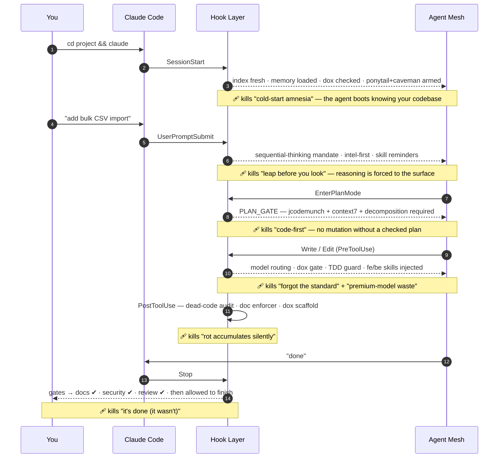
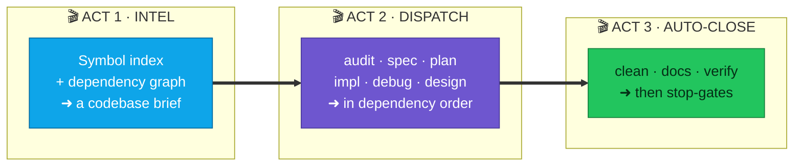
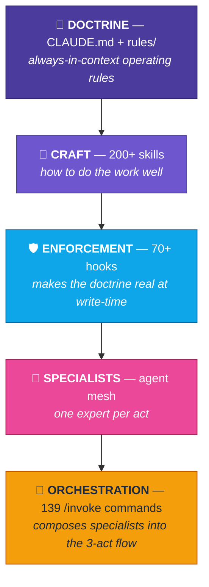

<div align="center">

# ⚡ claude-workflow

### The agentic-dev environment that refuses to vibe-code.

*One `git clone` turns a stock Claude Code install into a disciplined engineering team that **plans before it codes, routes work to the right specialist, enforces standards at write-time, and proves it's done before it says so.***

<br/>


<br/>

**[The Problem](#-the-problem-nobody-fixed) · [What Happens on Enter](#-what-actually-happens-when-you-hit-enter) · [One Prompt's Journey](#-the-journey-of-a-single-prompt) · [Problems Killed](#-every-step-kills-a-real-problem) · [Install](#-install)**

</div>

---

## 🩸 The problem nobody fixed

AI coding agents are brilliant and **undisciplined**. Left alone, the same failures repeat on every task:

<div align="center">

| 😖 Stock agent | ⚡ claude-workflow |
|---|---|
| Forgets your standards halfway through | **Injects the right standard on every write** |
| Reads whole files, burns tokens, still misses the caller | **Symbol index + dependency graph answer in one call** |
| Codes first, understands never | **Gate: no code until it has a plan** |
| "Done!" — it wasn't tested | **Runs the real flow, captures real output** |
| Leaves dead code and rotted docs behind | **Sweeps orphans + syncs docs, every time** |
| Ships the SQL-injection you didn't see | **Semgrep + OWASP gate says BLOCK** |
| Burns premium-model $ on a one-line fix | **Routes each subagent to the cheapest capable model** |

</div>

> [!WARNING]
> **This is opinionated on purpose.** The hooks enforce *real* gates — TDD advisories, a per-directory documentation tree, dead-code sweeps, security scans, skill-routing, and model-routing. It will nudge (and sometimes block) you toward one way of working. That is the whole point. Skim [What the hooks enforce](#-what-the-hooks-enforce) before installing so nothing surprises you.

---

## 🎬 What actually happens when you hit Enter

Every task runs the same disciplined spine — **understand → build → auto-close → prove** — with gates that don't let sloppiness through. This is the full lifecycle, from the moment you open a project to the moment the agent is *allowed* to say "done":



**The magic:** you don't invoke those stages by hand. The command name composes them — `/invoke-audit-spec-plan-impl-clean` runs the whole spine; `/invoke-debug` runs one act. **139 commands, generated from a single config**, cover every combination you'd ever want.

---

## 🧭 The journey of a single prompt

Zoom into *one* prompt. Here is literally every checkpoint it passes — from the shell to the final answer — and the invisible hook layer working the whole time so you don't have to:



Nothing above is something you have to remember. **The hooks remember for you.**

---

## 🛡️ Every step kills a real problem

This is the part that matters. Each layer of the workspace exists to permanently retire one failure mode of agentic development:

<div align="center">

| The agent used to… | …now it *structurally can't*, because | Layer |
|---|---|---|
| 🧠 Forget your standards mid-task | **200+ skills injected path-ranked on every write** (`fe_*` / `be_*` routing) | Enforcement |
| 🔦 Read whole files & burn tokens | **`codebase-intel-first`** steers to a symbol index + dep graph; **lean-ctx** compresses I/O | Doctrine + MCP |
| 🏃 Code before understanding | **plan-mode gate** + **spec-before-code** | Enforcement + Specialists |
| 🧪 Skip tests | **TDD guard** flags implementation written before a failing test | Enforcement |
| ☠️ Leave dead code behind | **`deadcode-reaper`** removes only what *your* diff orphaned — delete-safe | Specialists |
| 📉 Let docs rot | **dox tree** + **`docs-sync-agent`** update every directory you touch | Enforcement + Specialists |
| 🕳️ Ship security holes | **`security-sentinel`** — semgrep + OWASP → **BLOCK / PASS** | Specialists |
| 🤥 Lie about "done" | **`qa-verifier`** — real run, real output, **evidence-before-assertion** | Specialists |
| 💸 Burn premium-model $ on trivial work | **model routing** → cheapest capable model per subagent | Enforcement |
| 🎈 Over-engineer & bloat | **ponytail** — the laziest solution that actually works | Doctrine |
| 📜 Drown you in prose | **caveman** — ~75% fewer tokens, full technical accuracy | Doctrine |
| 🔁 Re-derive structure every session | **jcodemunch index + graphify graph** kept fresh by guards | MCP + Enforcement |
| 🌫️ Reason invisibly | **sequential-thinking mandate** externalizes every non-trivial decision | Doctrine |
| 🫥 Forget across sessions | **memory MCP** + **CODEX.md** working log | Doctrine + MCP |

</div>

---

## 🎯 The 3-act `/invoke` flow

Under the hood, every one of the 139 commands runs the same three acts. That uniformity is why they compose so cleanly:



```
ACT 1  Intel      → build a codebase brief (symbol index + dependency graph)
ACT 2  Dispatch   → hand the brief to one or more specialist agents, in order
ACT 3  Auto-close → dead-code sweep · doc sync · verification · stop-gates
```

Pick the acts you need and the command name writes itself: `/invoke-spec-plan-impl`, `/invoke-audit-debug-clean`, `/invoke-plan-impl-design`, … **139 in total, generated deterministically from one config file.**

---

## 🤖 Specialist corps

Nine first-class specialists, each owning exactly one act of the pipeline. Clean context, sharp scope, no jack-of-all-trades mush:

<div align="center">

| Agent | Act | Owns |
|-------|----------|------|
| 🔬 `audit-specialist` | **AUDIT** | Forensic hotspots, coupling/churn, dead code, repo-health — cited findings. |
| 📐 `spec-architect` | **SPEC** | Requirements → typed contracts, acceptance criteria, an explicit Not-Doing list. |
| 🗺️ `planning-director` | **PLAN** | Spec → dependency-ordered, file-pathed, per-task-TDD plan. |
| ⚙️ `implementation-engineer` | **IMPLEMENT** | Executes the plan task-by-task with TDD *(runs on Opus by directive)*. |
| 🐞 `debug-detective` | **DEBUG** | Reproduce → demonstrate root cause → minimal fix. *No fix before cause.* |
| 🧹 `deadcode-reaper` | **CLEANUP** | Removes only what *this* session's diff orphaned; delete-safe. |
| 🕵️ `security-sentinel` | **SECURITY** | Semgrep + OWASP pass on the diff → BLOCK/PASS verdict. |
| 📖 `docs-sync-agent` | **DOCS** | Syncs docs + the per-directory `CLAUDE.md` tree to the change. |
| ✅ `qa-verifier` | **VERIFY** | Runs the real flow and captures real output — evidence before "done". |

</div>

`frontend-uiux-designer` owns all visual/UX work via a six-skill design stack. Dozens of GSD, Figma, and Vercel helper agents round out the roster.

---

## 🏛️ Five layers, one discipline



| Layer | Path | Role |
|-------|------|------|
| **1 · Doctrine** | `CLAUDE.md`, `rules/` | Always-in-context operating rules — model routing, skill protocol, TDD/dox/codebase-intel doctrine. |
| **2 · Craft** | `skills/` | 200+ skills the agent invokes to *do the work well* (standards, testing, security, design, forensics). |
| **3 · Enforcement** | `hooks/` | 70+ hooks that make the doctrine real — skill injection, index guards, write gates, model guards, stop-gates. |
| **4 · Specialists** | `agents/` | A specialist agent mesh (the `/invoke` corps + a UI/UX designer + GSD/Figma/Vercel helpers). |
| **5 · Orchestration** | `commands/` | 139 `/invoke-*` commands composing the specialists into the 3-act flow. |

---

## 🚀 Install

**One command** (clone next to your home, then run the installer):

```bash
git clone https://github.com/AjayIrkal23/claude-workflow ~/.claude-repo && ~/.claude-repo/install.sh
```

The installer is **Ubuntu-focused, idempotent, and non-destructive**:

- If `~/.claude` **doesn't exist**, it copies the workspace straight in.
- If `~/.claude` **already exists**, it makes a timestamped backup (`~/.claude-backup-<ts>.tgz`) and then **merges** the workspace in — it never deletes files you already have (no `rsync --delete`).
- It offers, with consent prompts, to clone the re-installable externals (gstack, ast-grep-mcp).
- It prints exactly what you still need to do yourself: install plugins, configure MCP servers, and export your own secrets.

Requires `git` + `python3`. Optional: `bun` (to build the gstack skill), `gh`, `rsync`, `uv`.

Everything path-related uses `$HOME` / `~` — **no hardcoded usernames**, so it works for any user on Ubuntu out of the box.

> [!TIP]
> Want a lighter footprint? Everything is à-la-carte. Prune `settings.json` and any hooks you don't want — the system fails *open* where it matters, so removing a gate degrades gracefully instead of breaking.

---

## 🧩 What's NOT included

By design, the repo excludes anything that is a secret, a session artifact, personal data, or re-installable from elsewhere:

- **Secrets** — `.credentials.json`, API keys, tokens, and `~/.claude.json` (your MCP config) are never committed. `settings.json` references env vars (e.g. `${GITHUB_TOKEN}`) instead.
- **Sessions & personal data** — `projects/`, `history.jsonl`, `sessions/`, `file-history/`, `todos/`, shell snapshots, and per-machine state.
- **Re-installable externals** — the plugin cache/marketplaces, `skills/gstack/`, `ast-grep-mcp/`, and the GSD (`get-shit-done/`) system. The installer + notes fetch these.
- **Machine-specific manifests** — plugin install-paths and index-guard project roots, which are regenerated per machine.

After install, finish the setup:

1. **Plugins** — add the 5 marketplaces (`anthropics/claude-plugins-official`, `veelenga/claude-mermaid`, `obra/superpowers-marketplace`, `forrestchang/andrej-karpathy-skills`, `DietrichGebert/ponytail`) and `claude plugin install` the ones you want (superpowers, ponytail, karpathy-skills, mermaid, frontend-design, context7, supabase, firecrawl, playwright, clickhouse, LSPs, …).
2. **MCP servers** — the hooks expect `jcodemunch`, `graphify`, `lean-ctx`, `memory`, `sequential-thinking`, and `context7` configured in your own `~/.claude.json`. `settings.json` also references `ast-grep`, `semgrep`, `playwright`, and others — trim what you don't use.
3. **Secrets** — export your own tokens; nothing is shipped.

---

## 🛠️ Customization

This workspace is meant to be forked and tuned:

- **`hooks/autonomous-skill-router.config.json`** — the single source of truth for the `/invoke` suite: which skills each category loads, which model runs it, and how commands compose. Edit this, not the generated files.
- **`hooks/gen-invoke-commands.py`** — regenerates all 139 `/invoke-*` commands from that config (`python3 hooks/gen-invoke-commands.py`). The output is deterministic.
- **`skills/.provenance.json`** — tracks every skill's upstream source and version, so you can see what's authored-here vs. vendored, and update accordingly.
- **`settings.json`** — the hook wiring, MCP servers, model, and permissions. `rules/` + `CLAUDE.md` hold the always-on doctrine.

---

## 🚧 What the hooks enforce

So there are no surprises — the workspace ships opinionated gates. The notable ones:

- **Skill routing** — path-ranked skills are injected on writes; a session skill manifest batches what you haven't read.
- **Codebase-intel-first** — blind source reads are steered toward the `jcodemunch` symbol index + `graphify` dependency graph.
- **TDD guard** (warn mode) — flags implementation written before a failing test. Advisory, not blocking, but treated as a directive.
- **dox documentation tree** — every git repo gets a `CLAUDE.md` + `AGENTS.md` in every directory; code writes are gated until a root `CLAUDE.md` exists.
- **Model routing** — subagents default to the cheapest capable model unless explicitly escalated.
- **Stop-gates** — docs sync, security scan (when auth files change), and a review pass before a session is allowed to end.

All hooks fail *open* where it matters, but they will change how the agent behaves. If you want a lighter setup, prune `settings.json` and the `hooks/` you don't want.

---

## 🙏 Credits

This workspace stands on excellent third-party skills. **Each keeps its own upstream license** — see each project for terms. Huge thanks to their authors:

| Skill / suite | Upstream |
|---------------|----------|
| Impeccable (UI/UX craft) | [pbakaus/impeccable](https://github.com/pbakaus/impeccable) |
| Huashu Design (花叔) | [alchaincyf/huashu-design](https://github.com/alchaincyf/huashu-design) |
| UI/UX Pro Max | [nextlevelbuilder/ui-ux-pro-max-skill](https://github.com/nextlevelbuilder/ui-ux-pro-max-skill) |
| Taste-Skill (anti-slop frontend) | [Leonxlnx/taste-skill](https://github.com/Leonxlnx/taste-skill) |
| gstack (ship/QA/browse/design suite) | [garrytan/gstack](https://github.com/garrytan/gstack) |
| Superpowers | [obra/superpowers-marketplace](https://github.com/obra/superpowers-marketplace) |
| Ponytail (anti-over-engineering) | [DietrichGebert/ponytail](https://github.com/DietrichGebert/ponytail) |
| Karpathy Guidelines | [forrestchang/andrej-karpathy-skills](https://github.com/forrestchang/andrej-karpathy-skills) |
| ast-grep MCP | [ast-grep/ast-grep-mcp](https://github.com/ast-grep/ast-grep-mcp) |

Frontend design assets are generated with Higgsfield; GSD (`get-shit-done`) supplies the `gsd-*` command system. `skills/.provenance.json` records the exact source and pinned version of every vendored skill.

---

## 📄 License

The workspace's own authored content (hooks, agents, commands, rules, self-authored skills, and this documentation) is **MIT-licensed** — see [LICENSE](LICENSE). © 2026 Ajay Irkal.

**Third-party skills under `skills/` retain their own upstream licenses** (see the Credits table). MIT applies to the original work in this repository, not to vendored code.

<div align="center">
<br/>

**If your agent has ever vibe-coded you into a corner — this is the way out.**

⭐ *Star it, fork it, bend it to your taste.*

</div>
