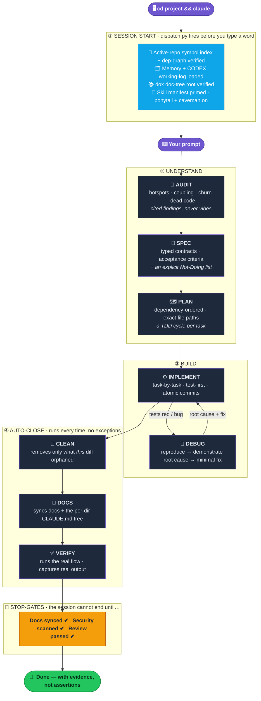
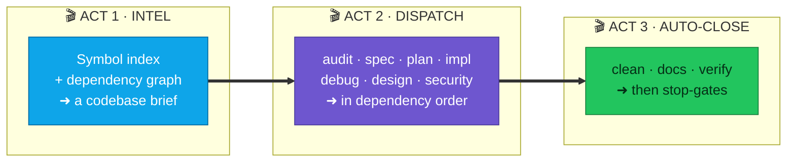
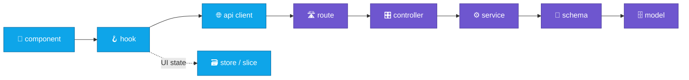
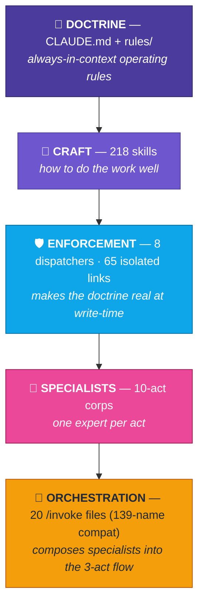

<div align="center">

# ⚡ agentic-mercy-10x

### The agentic-dev environment that refuses to vibe-code.

*One `git clone` turns a stock Claude Code install into a disciplined engineering team that **plans before it codes, routes work to the right specialist, enforces standards at write-time, and proves it's done before it says so.***

<br/>


<sub><i>The whole workbench in one frame: raw prompt in, verified software out — every stage gated.</i></sub>

<br/><br/>


<br/>

**[The Problem](#-the-problem-nobody-fixed) · [The v2.0.0 Overhaul](#-why-v200-the-100x-overhaul) · [On Enter](#-what-actually-happens-when-you-hit-enter) · [8 Superpowers](#-eight-superpowers-218-skills) · [Architecture](#-architecture--six-pillars) · [Token Economy](#-the-token-economy) · [Install](#-install)**

</div>

---

## 🩸 The problem nobody fixed

AI coding agents are brilliant and **undisciplined**. Left alone, the same failures repeat on every task:

<div align="center">

| 😖 Stock agent | ⚡ agentic-mercy-10x |
|---|---|
| Forgets your standards halfway through | **Injects the right standard on every write** |
| Reads whole files, burns tokens, still misses the caller | **Symbol index + dependency graph answer in one call** |
| Codes first, understands never | **Gate: no code until it has a plan** |
| "Done!" — it wasn't tested | **Runs the real flow, captures real output** |
| Leaves dead code and rotted docs behind | **Sweeps orphans + syncs docs, every time** |
| Ships the SQL-injection you didn't see | **Semgrep + OWASP gate says BLOCK** |
| Burns premium-model $ on a one-line fix | **Routes each subagent to the cheapest capable model** |

</div>

> [!WARNING]
> **This is opinionated on purpose.** The hooks enforce *real* gates — TDD advisories, a per-directory documentation tree, dead-code sweeps, security scans, skill-routing, and model-routing. It will nudge (and sometimes block) you toward one way of working. That is the whole point. Skim [What the hooks enforce](#-what-the-hooks-enforce) before installing so nothing surprises you.

---

## 🚀 Why v2.0.0 — the 100x overhaul

The workbench grew organically until it fought itself: prompt-time work fanned out across a fleet of independent injector hooks (one subprocess each), **65 loose hook registrations**, hundreds of skill folders with silent duplicates, and **139 hand-written command files**. A **579-item forensic audit** (`plans/AUDIT-2026-07-11-100x.md`) catalogued every rough edge — and v2.0.0, the *"100x Workflow Overhaul,"* is the answer.

**The through-line: many moving parts → one source of truth per concern.**

<div align="center">

| Concern | Before | After (v2.0.0) |
|---|---|---|
| Prompt-time routing | ~11 injector hooks, one subprocess each | **1 classify-once router** (in-process delegates) |
| Hook wiring | 65 loose registrations | **8 event dispatchers**, every hook still its own isolated file |
| Skills | hundreds of folders, silent duplicates | **218 names** (194 bodies + 24 aliases), 128 upstream-locked & hash-verified |
| Commands | 139 hand-written files | **20 files**, all 139 historic names still resolve |
| Model choice | Opus-biased, guard crashed on args | **1 `model-policy.json`** — Sonnet default, guard crash fixed |
| Indexing | background daemons | **event-driven, active-repo-only, zero daemons** |
| Platform | Ubuntu-only, `.sh` hooks | **`install.py` for Ubuntu + Windows**, zero shell hooks |

</div>

Every retired part is preserved for rollback (`git tag pre-100x`, `attic/2026-07-11/MANIFEST.md`), and the two-OS CI matrix is green on **`ubuntu-latest` and `windows-latest`**.

---

## 🎬 What actually happens when you hit Enter

Every task runs the same disciplined spine — **understand → build → auto-close → prove** — with gates that don't let sloppiness through. This is the full lifecycle, from the moment you open a project to the moment the agent is *allowed* to say "done":



**The magic:** you don't invoke those stages by hand. One **parametric `/invoke <acts…>`** command composes them — `/invoke audit spec plan impl clean` runs the whole spine; `/invoke debug` runs one act. Ten acts (audit · spec · plan · impl · debug · design · clean · docs · verify · security) compose freely, and **all 139 historic command names still resolve** to the same acts.

---

## 🦸 Eight superpowers, 218 skills

Every skill in this workspace exists to give a developer one of eight superpowers. This is the full roster — **not a teaser, the actual inventory** — of what 10x's your day.

<div align="center">

</div>

<sub align="center"><i>Eight capability lanes, drawn from 218 skill names (194 bodies + 24 permanent aliases). 128 of them are upstream-locked and hash-verified byte-for-byte at install.</i></sub>

<br/>

### 🔬 ① ANALYZE — see the whole codebase in one call

> *The agent stops reading files blindly and starts querying a pre-built index. This is where the token savings come from.*

| Skill / tool | What it 10x's |
|---|---|
| `codebase-intel-first` | Doctrine: build a structural model **before** reading a single line |
| `jcodemunch-token-saver` | Symbol index — find a function, its callers, its blast radius in **one call**, not 20 file reads |
| `graphify` | Dependency graph — "who depends on X?", "how do A and B connect?" answered instantly |
| `project-structure-map` · `project-reference-linkage` | Layer boundaries + the cross-module wiring an unfamiliar repo hides |
| `lean-ctx` | Compressed I/O · 10 read modes · re-reads a file in **~13 tokens** |
| `caveman` | Output compression — **~75% fewer tokens**, full technical accuracy |

### 🗂️ ② ORGANIZE — a codebase that stays clean forever

| Skill | What it 10x's |
|---|---|
| `frontend-structure-standards` · `backend-standards-always-follow` · `service-layer-standards` | Domain-first FE folders + route → controller → service → schema BE boundaries |
| `scaffold-standards` · `domain-scaffold-patterns` | New domain? Get the exact file tree before any logic is written |
| `api-contract-standards` · `api-and-interface-design` | Stable envelopes + typed contracts across the FE/BE seam |
| `dead-code-and-change-audit` | Continuous hygiene — no orphaned imports, stale refs, or half-refactors survive |

### 🗺️ ③ EXECUTE — never vibe-code again

| Skill | What it 10x's |
|---|---|
| `plan-mode-gate` · `workflow-orchestrator` | Hard pre-flight: no code until there's a checked plan |
| `source-driven-development` | Every decision grounded in official docs, not stale memory |
| `sequential-thinking` (doctrine) | Externalize **all** reasoning — plan, audit, debug, decide |
| `ponytail` · `doubt-driven-development` | The laziest solution that works, then an adversarial self-review |
| `incremental-implementation` · `subagent-driven-development` | Ship in safe slices, fan out independent work |

### 🧪 ④ TEST — prove it works, don't claim it

| Skill | What it 10x's |
|---|---|
| `test-driven-development` · `golang-testing` | Red → green → refactor; table-driven Go tests |
| `webapp-testing` · `browser-testing-with-devtools` | Real-browser DOM, console, network, and visual checks |
| `verification-loop` · `eval-harness` | A finish line you have to actually cross |
| `systematic-debugging` · `debug-investigation` | Reproduce → root cause → minimal fix (no fix before cause) |

### 🛡️ ⑤ SECURE — ship without holes

| Skill / agent | What it 10x's |
|---|---|
| `owasp-security` · `security-and-hardening` | OWASP Top 10 (2025), ASVS, LLM/agentic threats baked into review |
| `security-sentinel` (agent) | Semgrep + OWASP pass on the diff → **BLOCK / PASS** |
| `backend-error-handling` | Safe logging, redaction, client-safe error mapping |

### 📖 ⑥ LEARN — never forget, never re-derive

| Skill / system | What it 10x's |
|---|---|
| `memory` (MCP) + memory protocol | Patterns, decisions, and fragile-area gotchas persist across sessions |
| `dox-doc-tree` | A `CLAUDE.md` + `AGENTS.md` in **every** directory — read root→target before editing |
| `update-docs` · `CODEX.md` | Docs + ADRs synced to the change, Gate-enforced; a living decision log |

### 🎼 ⑦ CREATE — a whole team of specialists in a box

| Skill / agent | What it 10x's |
|---|---|
| 10-act specialist corps + parametric `/invoke` | Audit · spec · plan · impl · debug · design · clean · docs · verify · security — composed on demand |
| `forensic-hotspot-finder` · `forensic-change-coupling` | Which files cause the most bugs; what secretly changes together |
| `forensic-complexity-trends` · `forensic-debt-quantification` | Is quality improving? What does the debt cost in **dollars**? |

### 🎨 ⑧ DESIGN — UI that doesn't look AI-generated

| Skill / engine | What it 10x's |
|---|---|
| `impeccable` · `taste-skill` · `ui-ux-pro-max` · `huashu-design` | Anti-slop craft: tokens, typography, hierarchy, motion |
| `frontend-ui-engineering` · `design-extract` | Production UIs; extract a design system from any live URL |
| **Higgsfield** asset engine | Bespoke image / video / 3D / audio — real assets, never placeholders |

---

## 🏛️ Architecture — six pillars

v2.0.0 is a single-truth system. Six pillars carry it, each with one source of truth and no hidden coupling.

### ① The unified prompt router + never-miss trigger floor

How does the right skill or specialist show up at the right moment, without you asking? A **single router** sits between your prompt and the work. It classifies intent **once** into a `TaskProfile`, ranks skills by the file paths you're touching, packs the highest-signal set into a **~24k priority budget**, and dedups anything already acknowledged this session.

<div align="center">

</div>

<sub align="center"><i>One classify-once router replaces the old fleet of injector hooks. Its trigger surface is a checksum-guarded floor of 1,973 verbatim rules — nothing routable is ever silently dropped.</i></sub>

<br/>

| Piece | What it does |
|---|---|
| **Classify-once `TaskProfile`** | Intent + touched paths are read a single time; every downstream decision reuses it |
| **Ranked selection → ~24k budget** | Only the highest-signal skills load, priority-ordered, deduped against the session manifest |
| **Trigger floor (`trigger-floor.json`)** | **1,973 verbatim entries** — a superset of every legacy keyword/path/intent rule, checksum-guarded, with a *never-remove* doctrine enforced in CI |
| **Self-tuning weights** | A weight-updater learns which skills actually helped and re-ranks future routing (floor rules stay weight-independent) |
| **One source of truth** | Every route + command composition lives in `hooks/autonomous-skill-router.config.json` |

> [!NOTE]
> **The router ships in 30-day SHADOW mode.** It runs *beside* the proven legacy stack and logs a zero-missed-trigger parity check on every prompt (fixtures: **12 prompts, 0 misses**). Cutover is one command — `flip-dispatch.py --router` — taken only after ≥10 real zero-miss sessions. See [Shadow mode](#-shadow-mode--the-honest-bit).

### ② Model policy — one file decides who runs on what

<div align="center">

| Tier | When | Source of truth |
|---|---|---|
| **Sonnet** | Default for everything | `hooks/model-policy.json` |
| **Opus** | UI/UX work · genuinely heavy builds · the **IMPLEMENT** carve-out | `invoke_categories.IMPLEMENT: "opus"` |
| **Fable** | Explicit user request only — never automatic | user-driven flag |

</div>

`model-policy.json` is the **single** place model choice lives. `opus-guard.py` pins each subagent's model from its `[sonnet]`/`[opus]`/`[fable]` prefix, and `workflow-model-guard.py` stops workflow subagents inheriting an Opus parent — the historical arg-drop crash there is **fixed, with regression tests**.

### ③ Hook orchestration — 8 dispatchers, every hook still its own file

Skills are *advice.* **Hooks are the enforcement.** v2.0.0 collapses **65 loose registrations into 8 per-event `dispatch.py` orchestrators** — but every original hook survives as its own isolated module with a `type`, an `enabled` flag, a priority, and a token budget. One link crashing can't take down its event.

<div align="center">

</div>

<sub align="center"><i>Five lifecycle phases, now driven by 8 dispatchers instead of 65 scattered registrations. Parity is proven 65/65 and a link-doctor synthetically fires every link.</i></sub>

<br/>

Some links don't just advise — they **gate.** A risky change runs a gauntlet before it's allowed through, and a session can't even *end* until the closing gates pass:

<div align="center">

</div>

<sub align="center"><i>The gate chain: model routing → intel-first → TDD guard → dox tree → security scan → review — enforced by isolated links inside the pre-write and Stop dispatchers.</i></sub>

<br/>

| Phase | What the dispatcher does | Isolated links (a few) |
|---|---|---|
| **① SessionStart** | Boot knowing the codebase | `jcodemunch-index-guard` · `memory-load-on-start` · `dox-tree-guard` · `tdd-guard-init-guard` |
| **② UserPromptSubmit** | Shape the request | `sequential-thinking-mandate` · the unified router (shadow) |
| **③ PreToolUse** | Gate & route every action | `opus-guard` · `jcodemunch-enforce` · `dox-write-gate` · `tdd-guard-gate` · `security-scan-gate` |
| **④ PostToolUse** | Clean up after every write | `desloppify-cleanup` · `doc-update-enforcer` · `dox-child-scaffold` |
| **⑤ Stop** | Prove it's done, then learn | `hard-completion-gate` · `santa-method-writer` · `session-memory-writer` |

### ④ Active-repo index lifecycle — zero background daemons

Every superpower rests on the agent **never working blind** — but that no longer costs you a background process. `index-lifecycle.py` is an **event-driven state machine** that keeps four surfaces fresh (jcodemunch, jdocmunch, graphify, dox) **for the active repo only**, via **detached single-shot builders** with a debounced reindex (N=5 writes or T=45s). There are **zero daemons**, and by construction it *cannot* touch any other repo.

<div align="center">

</div>

<sub align="center"><i>Symbol index + dependency graph, refreshed on session and write events — active repo only, single-shot builders, no always-on watchers.</i></sub>

<br/>

**Why it matters:** a stock agent re-derives structure with grep on *every* task and still misses cross-module edges. Here it's a one-call lookup against an always-current map — which is exactly where the [token savings](#-the-token-economy) come from.

### ⑤ Skill provenance & FATE — merges you can trust

Consolidating skills is dangerous if it silently rewrites vendored code. v2.0.0 makes it **provenance-aware**: **128 upstream-locked skills are hash-verified byte-intact** at install (validator rule R10), so cloned skill packs update cleanly. Only **24 user-authored duplicates** were folded into **14 canonicals** — and each old name lives on as a permanent routing alias. **Zero skills deleted.** The full record is in `hooks/skills-provenance.json`.

### ⑥ The `/invoke` surface — 20 files, 139-name compat

Type `/invoke audit spec plan impl design` and a **whole cross-functional team wakes up in order** — an auditor, an architect, a planner, an engineer, a designer — each a clean-context specialist handing its artifact to the next. And you often don't even type it: a plain-English prompt like *"fix this bug and clean up"* is auto-classified and the matching chain fires on its own.

<div align="center">

</div>

<sub align="center"><i>One parametric /invoke composes the ten-act specialist corps. 20 command files back it; all 139 historic names resolve through the invoke_compat translator.</i></sub>

<br/>

Under the hood, every invocation runs the same **three acts** — which is why they compose so cleanly:



The **20 files** are: one parametric `/invoke <acts…>` + 10 single-act delegators + `invoke-fullstack` + 5 muscle-memory aliases + 3 utilities (`invoke-session` / `invoke-status` / `invoke-update`). All 139 historic combo names resolve via `invoke_compat`, and `--emit-combos` re-expands every legacy file in seconds if you ever want them back on disk.

#### The specialist corps

<div align="center">

| Agent | Act | Owns |
|-------|----------|------|
| 🔬 `audit-specialist` | **AUDIT** | Forensic hotspots, coupling/churn, dead code, repo-health — cited findings. |
| 📐 `spec-architect` | **SPEC** | Requirements → typed contracts, acceptance criteria, an explicit Not-Doing list. |
| 🗺️ `planning-director` | **PLAN** | Spec → dependency-ordered, file-pathed, per-task-TDD plan. |
| ⚙️ `implementation-engineer` | **IMPLEMENT** | Executes the plan task-by-task with TDD *(runs on Opus by directive)*. |
| 🐞 `debug-detective` | **DEBUG** | Reproduce → demonstrate root cause → minimal fix. *No fix before cause.* |
| 🎨 `frontend-uiux-designer` | **DESIGN** | Anti-slop UI via a six-skill design stack *(runs on Opus)*. |
| 🧹 `deadcode-reaper` | **CLEAN** | Removes only what *this* session's diff orphaned; delete-safe. |
| 📖 `docs-sync-agent` | **DOCS** | Syncs docs + the per-directory `CLAUDE.md` tree to the change. |
| ✅ `qa-verifier` | **VERIFY** | Runs the real flow and captures real output — evidence before "done". |
| 🕵️ `security-sentinel` | **SECURITY** | Semgrep + OWASP pass on the diff → BLOCK/PASS verdict. |

</div>

Dozens of GSD, Figma, and Vercel helper agents round out the roster.

---

## 💰 The token economy

Here is the part that pays for itself. A stock agent answers a question by **reading files** — it grep-scans, opens a dozen, and drowns its own context. This workspace answers by **querying a pre-built symbol index and dependency graph**, then compresses everything that flows through. And at the prompt layer, v2.0.0 collapses a fleet of injector subprocesses into **one router**.

```mermaid
xychart-beta
    title "Tokens spent per task — stock agent vs agentic-mercy-10x (illustrative)"
    x-axis ["Find callers", "Grok a module", "Re-read a file", "Explain change"]
    y-axis "Tokens" 0 --> 80000
    bar [45000, 80000, 3000, 1200]
    bar [1500, 6000, 13, 300]
```

<div align="center">

</div>

<sub align="center"><i>Two compounding wins: surgical index lookups instead of blind file dumps, and one classify-once router (packed into a ~24k priority budget) instead of many prompt-time injector spawns.</i></sub>



<div align="center"><i>Left/back bar = stock agent · front bar = this workspace. Illustrative estimates from each skill's stated savings.</i></div>

<br/>

| Everyday task | 🐌 Stock agent | ⚡ agentic-mercy-10x | Saved |
|---|---:|---:|---:|
| "Who calls `processPayment`?" | grep + read ~15 files ≈ **45k tok** | `find_references` ≈ **1.5k tok** | **~97%** |
| "Understand this module before editing" | read the whole dir ≈ **80k tok** | `assemble_task_context` ≈ **6k tok** | **~92%** |
| "Re-read a file after an edit" | full re-read ≈ **3k tok** | `lean-ctx` diff ≈ **13 tok** | **~99%** |
| "Explain the change you made" *(output)* | verbose prose ≈ **1.2k tok** | `caveman` ≈ **300 tok** | **~75%** |

> Numbers are illustrative estimates drawn from each skill's own stated savings (`jcodemunch-token-saver` ≈ 95% on retrieval, `caveman` ≈ 75% on output, `lean-ctx` ≈ 13-token re-reads). Your mileage varies with repo size — the *shape* of the win does not.

---

## 🧭 The agent always knows where to look

Point a stock agent at an unfamiliar repo and it wanders — opening files, guessing, backtracking. This workspace gives it a **GPS**: `codebase-start-point-guide` sets the entry point, and `project-reference-linkage` + `project-structure-map` trace the exact vertical slice a change touches, so it walks straight to the right files and skips the rest.

<div align="center">

</div>

<sub align="center"><i>Start point → the exact vertical slice → done. The linkage map keeps every node in the chain traceable so nothing downstream is missed.</i></sub>

<br/>



---

## 🗂️ Your codebase stays structured — forever

Left unattended, an AI agent turns any codebase into spaghetti — files wherever, types inline, dead code everywhere. This workspace makes structure **non-optional**: every new domain lands in a known shape, every layer boundary is enforced, and the cross-module wiring is mapped before anything is touched.

<div align="center">

</div>

<sub align="center"><i>The default outcome, not the hoped-for one: domain-organized structure enforced at scaffold time, write time, and close time.</i></sub>

<br/>

### The standards, made visual

Four always-on skill sets decide *where every file goes and what shape it takes* — so the structure above is what you get by default:

<table>
<tr>
<td width="50%"><br/><b>Frontend</b> — <code>frontend-structure-standards</code> · <code>frontend-standards-always-follow</code>: domain-first folders, central type ownership, a hard 250-line file ceiling.</td>
<td width="50%"><br/><b>Backend</b> — <code>backend-standards-always-follow</code> · <code>service-layer-standards</code> · <code>backend-api-standards</code>: route → controller → service → schema → model boundaries that never blur.</td>
</tr>
<tr>
<td width="50%"><br/><b>Scaffold</b> — <code>scaffold-standards</code> · <code>domain-scaffold-patterns</code>: a new domain emits its exact file tree, validated against real Fastify/TS, FastAPI/Python, and Go/chi codebases.</td>
<td width="50%"><br/><b>Contract</b> — <code>api-contract-standards</code> · <code>api-and-interface-design</code>: one typed, stable envelope across the FE/BE seam — no parallel shapes.</td>
</tr>
</table>

Three enforcement layers keep it that way, permanently:

- **At scaffold time** — `scaffold-standards` + `domain-scaffold-patterns` emit the exact file tree.
- **At write time** — structure skills are injected on every edit; the 250-line ceiling and layer boundaries are checked.
- **At close time** — `dead-code-and-change-audit` sweeps orphans and the `dox` tree drops a `CLAUDE.md` into any directory you touched.

---

## 📖 A self-documenting codebase

The **dox tree** guarantees every directory in every repo carries a `CLAUDE.md` (+ `AGENTS.md`) — and the moment you create a new folder, a link inside the PostToolUse dispatcher **auto-scaffolds** its doc. Before editing, the agent reads root → target, so it always inherits the local rules of the exact place it's working.

<div align="center">

</div>

<sub align="center"><i>A doc in every folder, auto-scaffolded into new ones, read root → target before any edit — so the agent never violates a local rule it didn't know existed.</i></sub>

---

## 🎨 UI that never looks AI-generated

Most AI writes **slop UI** — templated cards, the same purple gradient, zero intention. This workspace refuses. A six-skill anti-slop design stack — on top of the **Higgsfield** asset engine — turns a brief into interfaces that look deliberately crafted.

<div align="center">

</div>

<sub align="center"><i>Slop in, craft out: the six-skill stack replaces templated defaults with intentional tokens, type, and hierarchy.</i></sub>

<br/>

<table>
<tr>
<td width="50%"><br/><b>The stack</b> — <code>impeccable</code> · <code>taste-skill</code> · <code>ui-ux-pro-max</code> · <code>huashu-design</code> · <code>frontend-ui-engineering</code> · <code>design-extract</code>, fed by Higgsfield-generated assets.</td>
<td width="50%"><br/><b>The loop</b> — the <code>frontend-uiux-designer</code> agent explores <b>3 variations</b>, runs a <b>self-critique</b> pass, then captures <b>screenshot proof</b> at real breakpoints before presenting.</td>
</tr>
</table>

---

## 🏛️ Five layers, one discipline



| Layer | Path | Role |
|-------|------|------|
| **1 · Doctrine** | `CLAUDE.md`, `rules/` | Always-in-context operating rules — model routing, skill protocol, TDD/dox/codebase-intel doctrine. |
| **2 · Craft** | `skills/` | 218 skill names the agent invokes to *do the work well* (standards, testing, security, design, forensics). |
| **3 · Enforcement** | `hooks/` | 8 event dispatchers wiring 65 isolated links — skill injection, index guards, write gates, model guards, stop-gates. |
| **4 · Specialists** | `agents/` | A ten-act specialist corps + a UI/UX designer + GSD/Figma/Vercel helpers. |
| **5 · Orchestration** | `commands/` | 20 `/invoke` files composing the specialists into the 3-act flow; all 139 historic names resolve. |

---

## 🚀 Install

**One command**, on Ubuntu/macOS **or** Windows. `install.py` is a stdlib-only bootstrap (Python ≥ 3.10), OS auto-detected via `hooks/lib/platform.py`, idempotent, and non-destructive.

**Ubuntu / macOS**

```bash
git clone https://github.com/AjayIrkal23/agentic-mercy-10x ~/.claude && python3 ~/.claude/install.py
```

**Windows (PowerShell)**

```powershell
git clone https://github.com/AjayIrkal23/agentic-mercy-10x $env:USERPROFILE\.claude ; py -3 $env:USERPROFILE\.claude\install.py
```

`install.py` runs, in order: **detect** OS/python/node/git → idempotent **deps** → register the **MCP servers** → **materialize** skills (copy or NTFS junction, never a symlink) → **render** `settings.json` from its tracked `settings.template.json` (+ `settings.user.json` overrides) → **build + validate** the skills catalog (R9 trigger-floor + R10 upstream-intactness) → run **doctor**.

```bash
python install.py doctor     # health + trigger-surface + model-routing verifier
python install.py update     # git pull --ff-only → deps → re-render → rebuild → doctor
```

Flags: `--dry-run` (print planned actions, mutate nothing) · `--ci` (skip networked steps). Every path resolves through `hooks/lib/platform.py` — **no hardcoded usernames or drive letters**, and there are **zero `.sh` hooks**, so it works for any user on either OS. The two-OS CI matrix (`ubuntu-latest` + `windows-latest`) is green.

> [!TIP]
> Want a lighter footprint? Everything is à-la-carte. Prune `settings.json` and any dispatcher links you don't want — the system fails *open* where it matters, so removing a gate degrades gracefully instead of breaking.

---

## 🛡️ Safety & rollback

The overhaul was built to be reversible at every layer:

- **Whole-release rollback** — `git checkout pre-100x` restores everything as it was.
- **Hook fabric** — `flip-dispatch.py --legacy` restores the pre-cutover 65-registration wiring in one command (for 30 days).
- **Router** — `flip-router.py --legacy` reverts to the legacy taxonomies; the new router only shadow-runs until you flip it.
- **Commands** — `--emit-combos` re-expands the 120 legacy combo files onto disk in seconds.
- **Everything retired** lives in `attic/2026-07-11/` with a justified `MANIFEST.md`. **Zero skills were deleted.**
- **Every new hook fails open** — a crash degrades to a pass, never a wedged session.

---

## 🌒 Shadow mode — the honest bit

The new unified router is real and running, but it is **not yet the primary path.** It ships in a **30-day SHADOW window**, executing *beside* the proven legacy stack and logging a zero-missed-trigger parity check on every prompt. The parity bar is absolute: **not one routable trigger may be missed.**

- Fixture harness today: **12 prompts, 0 misses.**
- Cutover requires ≥10 **real** zero-miss sessions, then a single `flip-dispatch.py --router`.
- Legacy retention closes 30 days after cutover, only if `trigger-miss-watch.jsonl` is empty.

Until then you lose nothing — the legacy stack does the work while the router proves it can take over. This is deliberate, and it's tracked in `plans/VERIFY-2026-07-11-100x.md`.

---

## ✅ Verification

Every number here comes from a real run on `main`, recorded in `plans/VERIFY-2026-07-11-100x.md` and `plans/REPORT-2026-07-11-100x.md`.

<div align="center">

| Check | Result |
|---|---|
| **pytest** (hook + router + installer suites) | **136 / 136** passed |
| **Skills validator** (R1–R10) | **0 HARD failures**; R9 floor OK; R10 **128 locked hash-clean** |
| **Doctor** (installer/doctor.py) | **13 / 13** PASS, 0 WARN, 0 FAIL |
| **Trigger floor** | **1,973** entries, checksum-matched, verbatim superset |
| **Dispatch parity** | **65 / 65** registrations accounted (57 mapped + 8 ported, 0 unmapped) |
| **Zero-miss fixtures** | **12 prompts, 0 misses** |
| **SessionStart wall** | **< 0.8s** (target < 2.5s) |
| **Symlinks** | **0** (Windows-safe) |
| **CI matrix** | green on **ubuntu-latest + windows-latest** (run 29180508005) |

</div>

---

## 🧩 What's NOT included

By design, the repo excludes anything that is a secret, a session artifact, personal data, or re-installable from elsewhere:

- **Secrets** — `.credentials.json`, API keys, tokens, and `~/.claude.json` (your MCP config) are never committed. `settings.json` references env vars (e.g. `${GITHUB_TOKEN}`) instead.
- **Sessions & personal data** — `projects/`, `history.jsonl`, `sessions/`, `file-history/`, `todos/`, shell snapshots, and per-machine state.
- **Re-installable externals** — the plugin cache/marketplaces, `skills/gstack/`, `ast-grep-mcp/`, and the GSD (`get-shit-done/`) system. The installer + notes fetch these.

After install, finish the setup:

1. **Plugins** — add the 5 marketplaces (`anthropics/claude-plugins-official`, `veelenga/claude-mermaid`, `obra/superpowers-marketplace`, `forrestchang/andrej-karpathy-skills`, `DietrichGebert/ponytail`) and `claude plugin install` the ones you want.
2. **MCP servers** — the hooks expect `jcodemunch`, `graphify`, `lean-ctx`, `memory`, `sequential-thinking`, and `context7` configured in your own `~/.claude.json`. Trim what you don't use.
3. **Secrets** — export your own tokens; nothing is shipped.

---

## 🛠️ Customization

This workspace is meant to be forked and tuned. Edit the **sources of truth**, not the generated artifacts:

- **`hooks/autonomous-skill-router.config.json`** — which skills each `/invoke` category loads and how the acts compose.
- **`hooks/model-policy.json`** — the single model truth (sonnet default · opus UI+heavy+IMPLEMENT · fable explicit-only).
- **`hooks/dispatch.config.json`** — the 8 dispatchers and their per-link enable flags, priorities, and budgets.
- **`hooks/gen-invoke-commands.py`** — regenerates the **20** `/invoke` command files deterministically; `--emit-combos` re-expands the legacy 120.
- **`hooks/skills-provenance.json`** — every skill's upstream source and version (authored-here vs. vendored).
- **`settings.json`** — rendered from `settings.template.json` + `settings.user.json`; holds hook wiring, MCP servers, and permissions.

---

## 🚧 What the hooks enforce

So there are no surprises — the workspace ships opinionated gates. The notable ones:

- **Skill routing** — path-ranked skills are injected on writes; the session manifest batches what you haven't read.
- **Codebase-intel-first** — blind source reads are steered toward the `jcodemunch` symbol index + `graphify` dependency graph.
- **TDD guard** (warn mode) — flags implementation written before a failing test. Advisory, but treated as a directive.
- **dox documentation tree** — every git repo gets a `CLAUDE.md` + `AGENTS.md` in every directory; code writes are gated until a root `CLAUDE.md` exists.
- **Model routing** — subagents default to Sonnet unless explicitly escalated (`model-policy.json`).
- **Stop-gates** — docs sync, security scan (when auth files change), and a review pass before a session may end.

All hooks fail *open* where it matters, but they change how the agent behaves. For a lighter setup, prune `settings.json` and the dispatcher links you don't want.

---

## 🙏 Credits

This workspace stands on excellent third-party skills. **Each keeps its own upstream license** — see each project for terms. The 128 upstream-locked skills are hash-verified byte-intact at install, and `hooks/skills-provenance.json` records the exact source and pinned version of every vendored skill. Huge thanks to their authors:

| Skill / suite | Upstream |
|---------------|----------|
| Impeccable (UI/UX craft) | [pbakaus/impeccable](https://github.com/pbakaus/impeccable) |
| Huashu Design (花叔) | [alchaincyf/huashu-design](https://github.com/alchaincyf/huashu-design) |
| UI/UX Pro Max | [nextlevelbuilder/ui-ux-pro-max-skill](https://github.com/nextlevelbuilder/ui-ux-pro-max-skill) |
| Taste-Skill (anti-slop frontend) | [Leonxlnx/taste-skill](https://github.com/Leonxlnx/taste-skill) |
| gstack (ship/QA/browse/design suite) | [garrytan/gstack](https://github.com/garrytan/gstack) |
| Superpowers | [obra/superpowers-marketplace](https://github.com/obra/superpowers-marketplace) |
| Ponytail (anti-over-engineering) | [DietrichGebert/ponytail](https://github.com/DietrichGebert/ponytail) |
| Karpathy Guidelines | [forrestchang/andrej-karpathy-skills](https://github.com/forrestchang/andrej-karpathy-skills) |
| ast-grep MCP | [ast-grep/ast-grep-mcp](https://github.com/ast-grep/ast-grep-mcp) |

Frontend design assets are generated with Higgsfield; GSD (`get-shit-done`) supplies the `gsd-*` command system.

---

## 📄 License

The workspace's own authored content (hooks, agents, commands, rules, self-authored skills, and this documentation) is **MIT-licensed** — see [LICENSE](LICENSE). © 2026 Ajay Irkal.

**Third-party skills under `skills/` retain their own upstream licenses** (see the Credits table). MIT applies to the original work in this repository, not to vendored code.

<div align="center">
<br/>

**If your agent has ever vibe-coded you into a corner — this is the way out.**

⭐ *Star it, fork it, bend it to your taste.*

</div>
