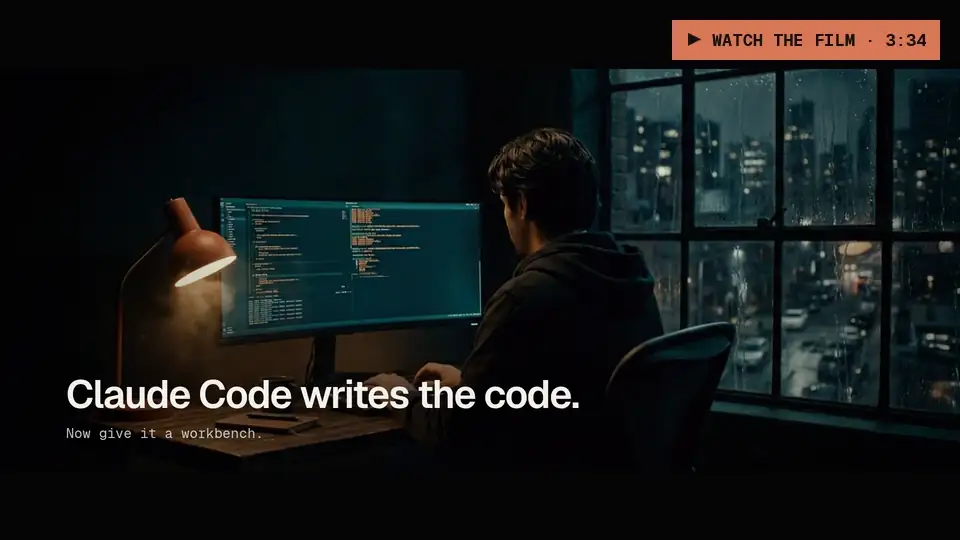
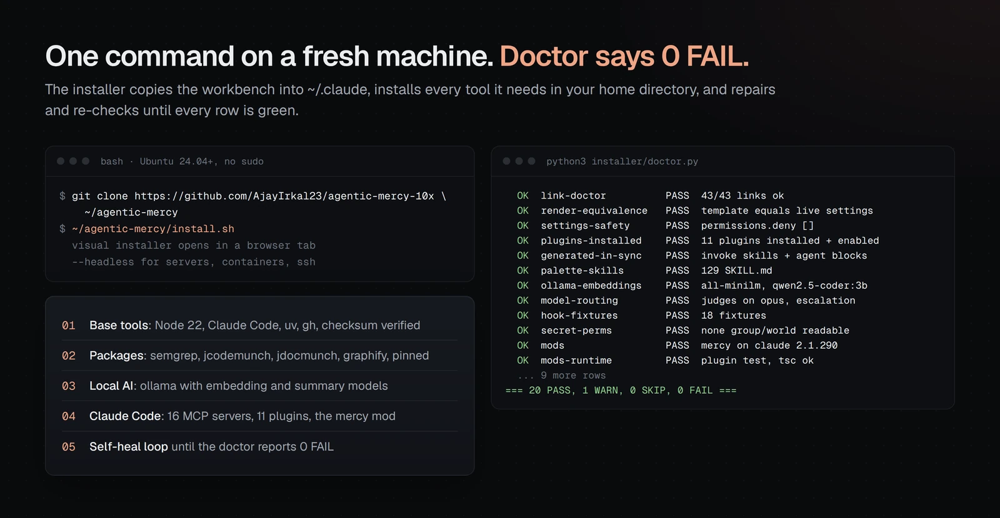
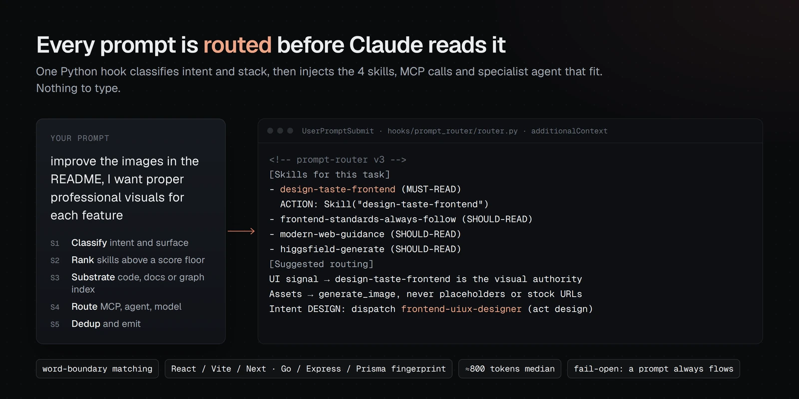
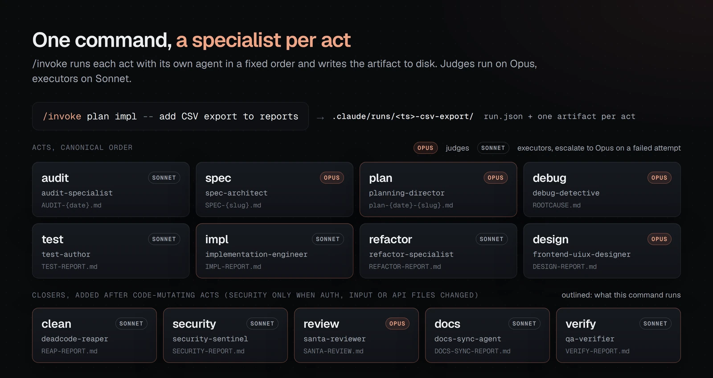
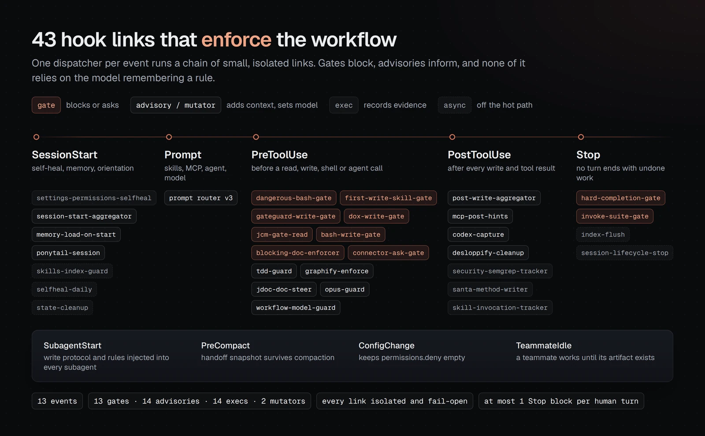
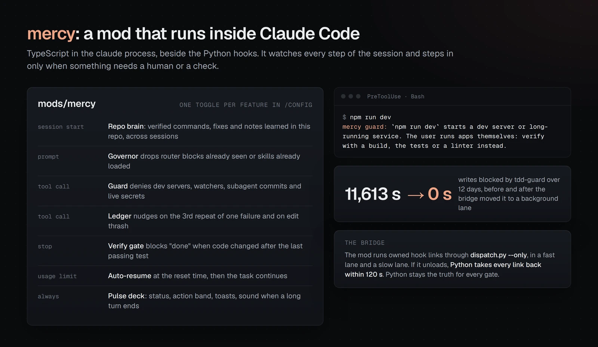
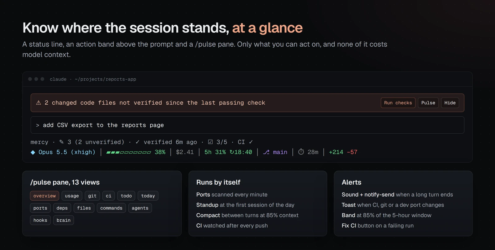
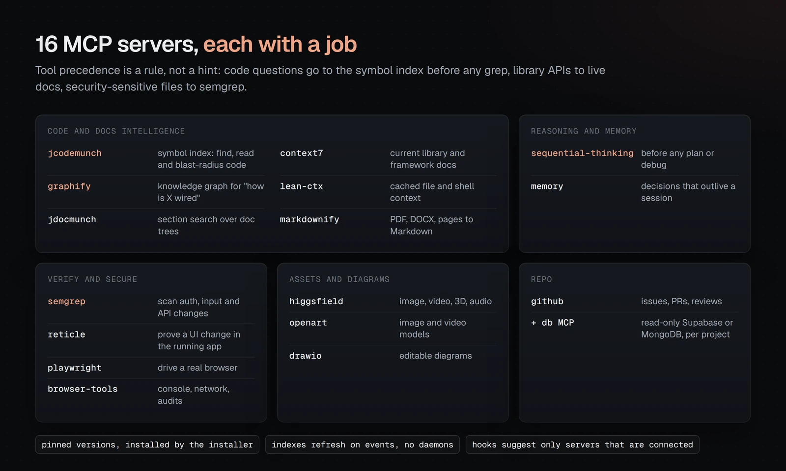

<div align="center">

<a href="https://storage.googleapis.com/docketrunvalidationbucket/launch-videos/agentic-mercy-10x-launch-v2.mp4"></a>

**[▶ Watch the launch film (3:34)](https://storage.googleapis.com/docketrunvalidationbucket/launch-videos/agentic-mercy-10x-launch-v2.mp4)** · [Download 1080p](https://storage.googleapis.com/docketrunvalidationbucket/launch-videos/download/agentic-mercy-10x-launch-v2-master.mp4) · [Release](https://github.com/AjayIrkal23/agentic-mercy-10x/releases/tag/launch-film-2026-10-06)

### One install, and every Claude Code prompt gets the right skill, tool, model and check.


**[Install](#install) · [Routing](#every-prompt-is-routed) · [/invoke](#invoke-a-specialist-per-act) · [Hooks](#hooks-that-enforce-the-workflow) · [mercy mod](#mercy-the-in-process-mod) · [Status deck](#status-line-and-pulse-deck) · [MCP](#16-mcp-servers-each-with-a-job) · [Verify](#verify) · [Changelog](docs/CHANGELOG.md)**

</div>

This repo is a complete `~/.claude`. Clone it, run one command, and every Claude Code
session starts with routed skills, specialist agents on the right model, hooks that stop
unsafe or unverified work, and a mod that watches the whole session from inside the
claude process. You keep writing prompts. Nothing here needs a slash command to work.

## Install

```bash
git clone https://github.com/AjayIrkal23/agentic-mercy-10x ~/agentic-mercy
~/agentic-mercy/install.sh              # visual installer, opens a browser tab
~/agentic-mercy/install.sh --headless   # same install in the console (servers, ssh)
```

Windows 10/11, nothing preinstalled, no admin: double-click `install.cmd` in the clone (or
`install.cmd -Headless` in a console; `install.cmd -Ci` only plans). It finds or installs a
pinned Python, then installs PortableGit (Git Bash), Node 22, Claude Code, uv, gh and ollama
per user into `%LOCALAPPDATA%\Programs\agentic-mercy` (override: `AGENTIC_MERCY_TOOLS_DIR`),
each download SHA-256 checked; tools already on PATH are reused.



A fresh Ubuntu 24.04+ needs only `git`, `curl` and `python3`, and no sudo. The installer
merges the clone into `~/.claude` (a file of yours that differs is kept as
`<name>.pre-install`), installs what is missing into your home directory, and re-checks
until the doctor reports 0 FAIL. Re-running is safe. The first run downloads about 3.5 GB,
mostly ollama and its models.

Four steps only you can do; the installer prints them at the end:
run `claude` once and sign in · authorize higgsfield and openart in `/mcp` ·
`gh auth login` · open a new terminal so `~/.local/bin` is on `PATH`.

<details>
<summary>What the installer puts on the machine</summary>

| Step | What |
|---|---|
| Base tools (no sudo) | Node 22 + npm (official tarball, checksum verified), Claude Code (pinned to the mod's minimum version), uv, gh → `~/.local/bin` |
| Packages | pinned semgrep, jcodemunch, jdocmunch, graphify (+ its serve venv), lean-ctx, tdd-guard, pyright, PyYAML |
| Local AI | ollama (user space) + the `all-minilm` embedding and `qwen2.5-coder:3b` summary models |
| Claude Code | 16 MCP servers at pinned versions, 5 marketplaces + 11 plugins, rendered `settings.json` (status line, mods env) |
| Workbench | re-vendored skills, generated `/invoke` skills and agent blocks, skills index, validators, doctor |
| OS tools (apt) | `canberra-gtk-play`, `notify-send`, `ss`, `pw-play` for the UI deck: installed with root or passwordless sudo, otherwise one `sudo apt-get install` line is printed. The deck works without them |

An existing `settings.json` is kept as `settings.json.pre-install`, and your env (Bedrock,
proxy), `apiKeyHelper`, `model`, permission mode and own hooks move into
`settings.user.json`. Offline machine: `AGENTIC_MERCY_SKIP_BASE_TOOLS=1`. Per project, a
read-only DB MCP: `python3 ~/.claude/scripts/add-db-mcp.py --supabase|--mongodb`.
Installer internals: [`installer/CLAUDE.md`](installer/CLAUDE.md).

</details>

## Every prompt is routed

`hooks/prompt_router/router.py` runs before Claude reads your prompt. It classifies the
intent and the repo's stack, then injects up to 4 ranked skills, the MCP calls to make
first and the specialist agent to dispatch, in about 800 tokens. The output below is real
router output from a prompt about this README, trimmed.



## /invoke: a specialist per act

`/invoke plan impl -- <task>` runs one agent per act in canonical order and writes each
artifact to `<repo>/.claude/runs/<ts>-<slug>/`. After any act that changes code, the
closers (clean, review, docs, verify, plus security when auth or input files changed) run
on their own. Opus judges spec, plan, debug, design and review; Sonnet executes and moves
up to Opus after a failed attempt. The whole policy lives in `hooks/model-policy.json`.



## Hooks that enforce the workflow

`settings.json` registers one `dispatch.py` per event, and each event runs a chain of
small links that are isolated and fail open. Gates stop destructive git and shell
commands, source reads that skip the code index, and commits that leave the docs behind.
At Stop, the completion gates check docs, semgrep, review and dead code, and block at most
once per turn.



## mercy: the in-process mod

`mods/mercy` is TypeScript that runs inside the claude process (Claude Code 2.1.288 or
later), next to the Python hooks. It learns each repo's verified commands, refuses dev
servers, watchers and live secrets, blocks "done" while edited code has not passed a
check, and resumes a task at the reset time after a usage limit. Running tdd-guard in its
background lane took blocked write time from 11,613 s over 12 days to zero.



## Status line and pulse deck

The status line shows model, effort, context, cost, the 5-hour window and git in about
20 ms. The band above the prompt offers one-key actions (Run checks, Compact, Fix CI), and
`/pulse` opens 13 views. None of it reaches the model unless you run a command.



## 16 MCP servers, each with a job

Each server has a rule for when to call it, set in
[`rules/00-tool-precedence.md`](rules/00-tool-precedence.md): jcodemunch before any grep,
context7 for library APIs, semgrep on auth and input changes, sequential-thinking before a
plan or a debug. Hooks only suggest servers that are connected, and the indexes refresh on
events with no daemons.



## Verify

```bash
python3 installer/doctor.py            # health: 0 FAIL expected
python3 -m pytest hooks/tests tests -q # hook + installer tests
python3 scripts/validate_skills.py     # skill catalog R1..R13
python3 scripts/validate_mods.py       # mods: contract, plugin validate --strict, plugin test
```

Escape hatch if a hook misbehaves: `claude --safe-mode`.

<details>
<summary>What is on disk</summary>

Counts change; recompute them rather than trusting this table.

| Thing | Count | Recompute with |
|---|---|---|
| Local skills | 129 | `ls skills/*/SKILL.md \| wc -l` |
| Agents | 17 + the `team-lead.md` playbook | `ls agents/*.md \| grep -v -e README -e team-lead \| wc -l` |
| Hook events wired | 13 (12 `dispatch.py` chains + the prompt router) | `settings.template.json` → `hooks` |
| Dispatch links | 43 enabled | `hooks/dispatch.config.json` → `chains` |
| MCP servers (user scope) | 16 | `installer/manifest.json` → `mcp_servers` |
| Plugins / marketplaces | 11 / 5 | `installer/manifest.json` → `plugins` |
| Vendored third-party skills | 27 sources | `hooks/skills-sources.json` |

</details>

<details>
<summary>Hook chains per event</summary>

Every hook is a link in `hooks/dispatch.config.json` (types `gate`, `mutator`, `advisory`,
`exec`, optional `async`). Architecture and link list: [`hooks/README.md`](hooks/README.md).

| Event | Chain highlights |
|---|---|
| SessionStart | permissions self-heal, state cleanup (async), aggregator, memory load, ponytail session, skills-index guard |
| UserPromptSubmit | prompt router |
| PreToolUse | dangerous-bash, first-write skill gate, gateguard, dox root, bash-write, doc enforcer, jcodemunch read gate, jdocmunch/graphify steer, tdd-guard (advisory), opus-guard, workflow-model-guard |
| PostToolUse | skill tracker, FE/BE reminder, codex capture, post-write aggregator, desloppify, semgrep tracker, MCP post-hints |
| PostToolUseFailure | tool-failure hint |
| Stop | completion gate, invoke-suite gate, index flush (async), lifecycle |
| SubagentStart / SubagentStop | subagent context / lifecycle |
| PreCompact / PostCompact | handoff snapshot / restore |
| ConfigChange | permissions-deny guard |
| TeammateIdle | teammate-idle gate |
| SessionEnd | permissions self-heal, index session-end |

</details>

<details>
<summary>Models and teams</summary>

Three layers, one truth (`hooks/model-policy.json`), details in
[`rules/04-model-routing.md`](rules/04-model-routing.md):

1. `env.CLAUDE_CODE_SUBAGENT_MODEL=sonnet`, the native default.
2. Every agent pins `model:` and `effort:` in frontmatter (opus for the 5 judges: santa,
   uiux, plan, spec, debug; sonnet for executors, which escalate).
3. `opus-guard` aligns the `[sonnet]`/`[opus]`/`[fable]` label with the model. Precedence:
   session flag > per-project mode > explicit `model` (pinned agents, escalation executors
   and fable only with the user's override phrase this turn) > agent pin > escalation >
   sonnet. Fable is never automatic.

Per-project mode: "use opus for this project" / "back to normal", or
`python3 ~/.claude/scripts/model-mode.py opus|sonnet|clear` inside the repo. A plain
`Agent` call has no `name`; a named call launches a teammate and follows
[`agents/team-lead.md`](agents/team-lead.md).

</details>

<details>
<summary>Repo layout</summary>

| Path | Holds |
|---|---|
| `CLAUDE.md`, `rules/` | always-on doctrine + path-scoped rules |
| `skills/` | local, vendored and synced skills (`invoke*` are generated) |
| `agents/` | specialist agents + the team playbook `team-lead.md` |
| `hooks/` | dispatcher, links, prompt router, configs, tests |
| `mods/` | Claude Code mods ([`mods/CLAUDE.md`](mods/CLAUDE.md)) |
| `installer/`, `install.*` | one-command installer and doctor |
| `scripts/` | vendoring, validation, model mode, DB MCP, inventory |
| `templates/`, `workflows/` | per-project MCP template; saved `/invoke-fullstack` workflow |
| `docs/` | [changelog](docs/CHANGELOG.md), [ADRs](docs/adr/), [index](docs/INDEX.md), archive |

Your own settings go in `settings.user.json`; `settings.json` is rendered from
`settings.template.json` and must never contain the string `lean-ctx`. Updating vendored
skills: `/invoke-update`, or `python3 scripts/vendor_skill.py --check`.

</details>

## Credits

Vendored and plugin skills keep their upstream licenses; sources are pinned in
`hooks/skills-sources.json` and `installer/manifest.json`. The hero art was generated with
GPT Image 2.5 on OpenArt; the feature plates are rendered from HTML with the real names
and output from this repo.

## License

MIT, see [`LICENSE`](LICENSE).
