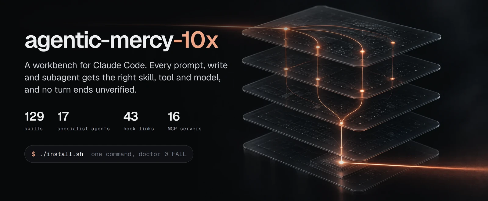

<div align="center">

# agentic-mercy-10x

### A routing and enforcement layer for Claude Code: every prompt, file, write and subagent gets the right skill, MCP server and model.




**[What it is](#what-it-is) · [How triggering works](#how-triggering-works) · [/invoke](#invoke-and-run-folders) · [Models and teams](#models-and-teams) · [Hooks](#hooks) · [Mods](#mods) · [Install](#install) · [Verify](#verify) · [Changelog](docs/CHANGELOG.md)**

</div>

---

## What it is

This repo *is* `~/.claude`. Cloned and installed, it gives Claude Code:

- a small always-on doctrine (`CLAUDE.md` + `rules/0*.md`) and path-scoped domain rules
  (`rules/frontend.md`, `rules/backend.md`, `rules/claude-infra.md`);
- a skill library, specialist agents, and an `/invoke` orchestrator that runs them in a
  fixed order with artifacts on disk;
- hooks that route context in at the moment it matters (prompt, file read, write, subagent
  start) and gates that stop a turn from ending with undone work;
- a one-command installer that reproduces all of it, including MCP servers and plugins,
  on a fresh machine.

### What is on disk (2026-09-28)

Counts change; recompute them rather than trusting this table.

| Thing | Count | Recompute with |
|---|---|---|
| Local skills | 129 (+ Anthropic-synced skills under `skills/synced/`) | `ls skills/*/SKILL.md \| wc -l` |
| Agents | 17 + the `team-lead.md` playbook | `ls agents/*.md \| grep -v -e README -e team-lead \| wc -l` |
| Hook events wired | 13 (12 `dispatch.py` chains + the prompt router) | `settings.template.json` → `hooks` |
| Dispatch links | 42 enabled | `hooks/dispatch.config.json` → `chains` |
| MCP servers (user scope) | 16 (adds `drawio`, pinned `@drawio/mcp@1.6.3`) | `installer/manifest.json` → `mcp_servers` |
| Plugins / marketplaces | 11 / 5 (`claude-session-driver` disabled) | `installer/manifest.json` → `plugins` |
| Vendored third-party skills | 27 sources | `hooks/skills-sources.json` |

## How triggering works

Six layers, each owning one moment. None of them depends on the model remembering a rule.

| Moment | Layer | What it does |
|---|---|---|
| Session start | `dispatch.py session-start` | settings self-heal, async state cleanup, orientation brief, memory `search_nodes("<repo>")` directive, skills-index freshness |
| Prompt | `hooks/prompt_router/router.py` (UserPromptSubmit) | word-boundary intent classification + stack/cwd-aware surface detection (repo fingerprint: React/Vite/Next vs Go/Express/Prisma/SQL; `claude-infra` inside `~/.claude`) → ≤5 ranked skills, ≤1 deep body, availability-aware MCP "call X now" lines, agent/act suggestion, per-project model-mode phrases. Emits `hookSpecificOutput.additionalContext`. |
| File touched | native skill `paths:` + path-scoped rules | FE/BE/API/infra skills and rules load when matching files are read — no hook involved |
| Write | `dispatch.py pre-tool-use` / `post-tool-use` | gates (dangerous bash, first-write skills, dox root, blast radius, tdd-guard advisory); post-write reminder of the canonical FE/BE set; `mcp-post-hints.py` (semgrep on security files, context7 on new imports, reticle/playwright when an app is already running, blast radius after >3 files) |
| Subagent start | `subagent-context.py` (SubagentStart) | injects the write protocol, no-servers/no-commit rules, MCP protocol and surface pointer into every subagent |
| Stop | `hard-completion-gate`, `invoke-suite-gate` | docs / security / Santa / dead-code gates, at most one block per turn |

MCP usage is a standing MUST (jcodemunch for code, graphify for architecture, jdocmunch
for doc sets, sequential-thinking for non-trivial reasoning, memory, context7 for library
APIs, semgrep for security-sensitive files). The table lives in
[`rules/00-tool-precedence.md`](rules/00-tool-precedence.md); hooks only suggest servers
that are actually connected and authorized.

## /invoke and run folders

`/invoke <acts...> [-- task]` (skill [`skills/invoke`](skills/invoke/SKILL.md)) runs one
specialist per act in canonical order:

`audit spec plan debug test impl refactor design clean security review docs verify`

- Each act also exists as a forked single-act skill (`/invoke-impl`, `/invoke-review`, …),
  plus `/invoke-session`, `/invoke-status`, `/invoke-update` (vendored-skill sync) and
  `/invoke-fullstack` (spec → plan → BE → FE → integrator → review/security/docs → QA,
  optional saved Workflow in `workflows/invoke-fullstack.js`).
- Artifacts land in `<repo>/.claude/runs/<ts>-<slug>/` with a `run.json`.
- Closers (clean, security, review, docs, verify) run only after code-mutating acts and
  never duplicate an act you named.
- The act table is single-sourced in `hooks/autonomous-skill-router.config.json`; models
  in `hooks/model-policy.json`. `python3 hooks/gen-invoke-skills.py` regenerates the
  family (`--check` verifies).

Agents and their acts: [`agents/README.md`](agents/README.md).

## Models and teams

Three layers, one truth (`hooks/model-policy.json`), details in
[`rules/04-model-routing.md`](rules/04-model-routing.md):

1. `env.CLAUDE_CODE_SUBAGENT_MODEL=sonnet` — the native default.
2. Every agent pins `model:` and `effort:` in frontmatter (opus for the 5 judges: santa,
   uiux, plan, spec, debug; sonnet for executors, which escalate).
3. `opus-guard` aligns the `[sonnet]`/`[opus]`/`[fable]` description label with the model.
   Precedence: session flag > per-project mode > explicit `model` / `[label]` (pinned
   agents, escalation executors and fable only with the user's override phrase this turn)
   > agent pin > escalation > sonnet. Fable is never automatic.

Per-project mode: "use opus for this project" / "back to normal", or
`python3 ~/.claude/scripts/model-mode.py opus|sonnet|clear` inside the repo.

**Deliberate teams.** Agent teams are enabled, but plain delegation is an `Agent` call
with no `name`. A named call launches a teammate; that is reserved for work that needs
teammate messaging (the fullstack BE↔FE contract handoff, a squad you ask for) and follows
[`agents/team-lead.md`](agents/team-lead.md). The `TeammateIdle` gate keeps a teammate
working until its expected artifact exists.

## Hooks

`settings.json` registers `dispatch.py <event>` once per event; every hook is a *link* in
`hooks/dispatch.config.json` (types `gate`, `mutator`, `advisory`, `exec`, optional
`async`), isolated and fail-open. The prompt router is registered directly.
Architecture and link list: [`hooks/README.md`](hooks/README.md).

| Event | Chain highlights |
|---|---|
| SessionStart | permissions self-heal, state cleanup (async), aggregator, memory load, ponytail session, skills-index guard |
| UserPromptSubmit | prompt router |
| PreToolUse | dangerous-bash, first-write skill gate, gateguard, dox root, bash-write, doc enforcer, jcodemunch read gate, jdocmunch/graphify steer, tdd-guard (advisory), opus-guard, workflow-model-guard |
| PostToolUse | skill tracker, FE/BE reminder, codex capture, post-write aggregator (index journal, dox scaffold, doc enforcer), desloppify, semgrep tracker, MCP post-hints |
| PostToolUseFailure | tool-failure hint (read-before-edit, etc.) |
| Stop | completion gate, invoke-suite gate, index flush (async), lifecycle |
| SubagentStart / SubagentStop | subagent context / lifecycle |
| PreCompact / PostCompact | handoff snapshot / restore |
| ConfigChange | permissions-deny guard |
| TeammateIdle | teammate-idle gate |
| SessionEnd | permissions self-heal, index session-end |

Indexes (jcodemunch, jdocmunch with ollama semantic search, graphify) stay fresh through
`hooks/index-lifecycle.py`: event-driven, active repo only, no daemons. `~/.claude` and
`$HOME` are never indexed and never get dox trees.

## Mods

`mods/mercy` is a Claude Code mod (a hooks module, Claude Code ≥ 2.1.288): TypeScript
that runs inside the claude process beside the Python hooks. The installer renders its
path into `env.CLAUDE_CODE_PLUGIN_DIRS`; each feature has a toggle in `/config`.

| Step | What the mod adds |
|---|---|
| Prompt | router governor (drops router blocks repeated within 6 turns and skills already loaded), live state line, queued advisories |
| System prompt | repo brain: verified commands, fixes and notes learned per repo, across sessions |
| Skill listing | business-plugin skill families left out of the listing inside code repos (they still run by name) |
| Tool call | guard (dev servers, watchers, subagent commits, live secrets), session ledger, failure-loop and edit-thrash nudges |
| Hook chain | bridge: post-write advisories and tdd-guard run in the background through `dispatch.py --only`; rare gates run only when they can fire |
| Stop | verify gate (code changed after the last passing test or build → run it first), late advisories |
| Usage limit | auto-resume at the reset time |
| UI and tools | status line, action band, `/pulse` pane, `/mercy` command; model tools `session_state`, `repo_facts`, `remember` |
| UI deck | `/pulse` views for usage (context, 5-hour/7-day limits with reset time, cost, burn rate, per-turn sparkline), git, GitHub CI and the model's task list; band rows for high context (Compact), the 5-hour window and failing CI (Fix CI); toasts on changes; desktop sound and `notify-send` when a long turn ends or Claude waits for you; cards for `/wrapup`, `/standup`, `/ports`, `/deps`; `/ci`, `/sound`; `/ui full\|focus\|quiet\|off` |

The settings status line (`scripts/statusline.py`, rendered from the template) shows model and
effort, a context bar, cost, the 5-hour window with its reset time, git branch and counts,
session time and lines changed, in about 20 ms. None of the UI reaches the model: only a
command's one-line `#n` summary does, and only when you run it.

The verify gate honours "stop" / "skip verification" and shares the one-block-per-human-turn
budget; the bridge hands a failed owned gate to Python for that very call (`MERCY_MOD_FAILED`).

Python stays the truth for every gate. If the mod is off or unloads, `dispatch.py` runs
every link again within 120 s. tdd-guard alone had blocked writes for 11,613 s over 12
days (p90 3.4 s per write); in the background it blocks none. Details:
[`mods/CLAUDE.md`](mods/CLAUDE.md).

## Install

A fresh Ubuntu 24.04+ needs only `git`, `curl` and `python3`; no sudo.

```bash
git clone https://github.com/AjayIrkal23/agentic-mercy-10x ~/agentic-mercy
~/agentic-mercy/install.sh              # visual installer (opens a browser tab)
~/agentic-mercy/install.sh --headless   # same install in the console (servers, containers, ssh)
```

One command, no prompts. `installer/bootstrap.py` finds `~/.claude`, merge-copies the
clone into it (your runtime data is preserved), and runs the self-heal loop until the
doctor reports 0 FAIL. It installs everything the workbench needs that is missing, in your
home directory:

| Step | What |
|---|---|
| Base tools (no sudo) | Node 22 + npm (official tarball, checksum verified), Claude Code (Anthropic's installer, pinned to the mod's minimum version), uv, gh → `~/.local/bin` |
| Packages | pinned semgrep, jcodemunch, jdocmunch, graphify (+ its serve venv), lean-ctx, tdd-guard, pyright, PyYAML |
| Local AI | ollama (user-space) + the `all-minilm` embedding and `qwen2.5-coder:3b` summary models |
| Claude Code | 16 MCP servers at their pinned versions, 5 marketplaces + 11 plugins, rendered `settings.json` (status line, mods env) |
| Workbench | re-vendored skills, generated `/invoke` skills and agent blocks, skills index, validators, doctor |
| OS tools (apt) | `canberra-gtk-play`, `notify-send`, `ss`, `pw-play`, `curl` for the UI deck: installed when the installer runs as root or has passwordless sudo, otherwise ONE `sudo apt-get install -y …` line is printed at the end. Never a failure; the deck degrades without them |

Re-running is safe (idempotent). Your own files are never lost: a `CLAUDE.md`, skill or agent of
the same name that differs is kept once as `<name>.pre-install`, and an existing `settings.json` is
kept as `settings.json.pre-install` with your env (Bedrock / proxy), `apiKeyHelper`, `model`,
permission mode and own hooks carried into `settings.user.json`. The first install downloads about
3.5 GB (mostly the ollama archive and the `qwen2.5-coder:3b` model). Offline machine:
`AGENTIC_MERCY_SKIP_BASE_TOOLS=1`.
`--ci` only plans the network steps (used by CI). Installer internals:
[`installer/CLAUDE.md`](installer/CLAUDE.md).

Human-only checklist (the installer prints it once at the end; none of it can be automated):

- [ ] run `claude` once and sign in;
- [ ] inside Claude Code run `/mcp` and authorize higgsfield and openart (OAuth);
- [ ] `gh auth login` (the github MCP reads its token from it);
- [ ] open a new terminal so `~/.local/bin` is on `PATH`.

Per project, a read-only DB MCP:
`python3 ~/.claude/scripts/add-db-mcp.py --supabase|--mongodb`
(template `templates/mcp/db-readonly.mcp.json`, project scope only).

Your own settings go in `settings.user.json`; `settings.json` is rendered from
`settings.template.json` and must never contain the string `lean-ctx`.

Updating vendored skills: `/invoke-update`, or `python3 scripts/vendor_skill.py --check`
then `vendor_skill.py <name> [--ref R]`.

## Verify

```bash
python3 installer/doctor.py            # health, 0 FAIL expected
python3 -m pytest hooks/tests tests -q # hook + installer tests
python3 scripts/validate_skills.py     # skill catalog R1..R13
python3 scripts/validate_mods.py       # mods: contract, plugin validate --strict, plugin test
python3 hooks/build-trigger-floor.py --check
python3 hooks/gen-invoke-skills.py --check
python3 hooks/gen-agent-skill-blocks.py --check
```

The doctor has 21 rows: `plugins-installed`, `secret-perms` and `mods-runtime` are new;
`mcp-roster` reports extras, pin drift and deprecated packages. Reclaimable disk (old
plugin versions, stale indexes, idle project dirs) is listed, never deleted, by
`python3 hooks/tools/retention-report.py`.

Escape hatch if a hook misbehaves: `claude --safe-mode`.

## Layout

| Path | Holds |
|---|---|
| `CLAUDE.md`, `rules/` | always-on doctrine + path-scoped rules |
| `skills/` | local, vendored and synced skills (`invoke*` are generated) |
| `agents/` | specialist agents + the team playbook `team-lead.md` |
| `hooks/` | dispatcher, links, prompt router, configs, tests |
| `mods/` | Claude Code mods (`mercy`: ledger, bridge, guard, verify gate, brain, auto-resume, pulse UI) |
| `installer/`, `install.*` | one-command installer and doctor |
| `scripts/` | vendoring, validation, model mode, DB MCP, inventory |
| `templates/`, `workflows/` | per-project MCP template; saved `/invoke-fullstack` workflow |
| `docs/` | [changelog](docs/CHANGELOG.md), [ADRs](docs/adr/), [index](docs/INDEX.md), archive |

## Credits

Vendored and plugin skills keep their upstream licenses; sources are pinned in
`hooks/skills-sources.json` and `installer/manifest.json`.

## License

MIT — see [`LICENSE`](LICENSE).
